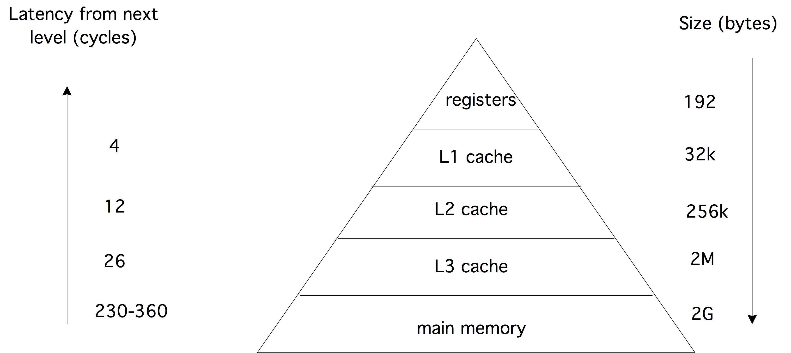

# 单处理器计算（一）

> 翻自：《Introduction to High Performance Scientific Computing》-Victor Eijkhout

了解计算机体系结构对编写高效、科学的代码具有十分重要的作用。两段代码的计算结果可能相等，但速度差异可能从几个百分点到数量级不等，这只取决于我们是如何基于处理器架构来编写算法的。显然，仅仅编写算法并“把它放到计算机上”是不够的，计算机架构知识也是至关重要的一项内容。

有些问题可以在单个中央处理单元(CPU)上解决，而有些问题则需要由多个处理器组成的并行计算机解决。我们将在下一章详细介绍并行计算机，但即便是使用并行计算机处理，也需要首先了解单个CPU的情况。

在该部分中，我们将重点关注CPU及其内存系统内部发生的事情。首先简要讨论指令是如何被执行的，然后将研究处理器核心中的算术处理；最后，我们将重点关注内存、处理器以及处理器内部的数据移动，这一点非常重要，因为内存访问通常比执行处理器指令慢得多，这使得它成为程序性能的阻碍因素；“flops(每秒浮点操作数)计数”作为预测代码性能的关键的时代已经一去不复返了。这种差异实际上是一个不断增长的趋势，所以随着时间的推移，处理内存流量的问题变得越来越重要，而非逐渐销声匿迹。

这一章将让你对CPU设计中涉及的问题有一个基本的了解，它是如何影响性能的，以及如何编写优化性能的代码。想学习更多细节，请参阅关于PC架构的在线书籍[114]，以及关于计算机架构的标准工作，Hennesey和Patterson[97]。

## 冯诺依曼架构

虽然本章即将提及的各类相关计算机，其处理器可以在许多细节上有所不同，但它们也有许多共同之处。抽象来看，许多架构都可以被描述为**冯·诺伊曼架构**。它描述了一种具有不可分割内存的设计，存储程序和数据(存储程序)，以及一个执行指令的处理单元，在“取、执行、存储周期”中对数据进行操作。

**注释1： ** 具有指定指令序列的模型也称为控制流。数据流相对应，我们将在后面中看到。

这种设置使现代处理器区别于最早的和一些特殊目的的现代处理器，在这些设计中程序是硬连接的。它还允许程序修改自己或生成其他程序，因为指令和数据在同一个存储器中。这使得我们有了编辑器和编译器：计算机将程序代码当作数据来处理。

**注释2：** 存储程序的概念曾作为一个基本组成，它使一个正在运行的程序能够修改它自己的源代码。然而，人们很快意识到这将导致不可维护的代码，因此我们在实际中很少这样做。

在本书中，我们不会明确讨论编译器这个把高级语言翻译成机器指令的程序。而是讨论如何编写高层次的程序以确保低层运行的效率。

在科学计算中，我们通常不太关注程序代码，几乎只关注数据及其在程序执行期间如何移动。在大多数实际应用中，程序和数据似乎是分开存储的。关于指令处理的基本内容可以描述如下。

与用户编写的高级语言不同，处理器执行的机器指令通常会指定操作的名称，操作数和结果的位置。这些位置不是表示为内存位置，而是表示为寄存器：是CPU的一部分的少量命名内存位置。

**注释3：** 我们很少分析到内存的架构，尽管它们已经存在。20世纪80年代的Cyber 205超级计算机可以同时有三个数据流，两个从内存到处理器，一个从处理器到内存。这样的架构只有在内存能够跟上处理器速度的情况下才可行，而现在已经不是这样了。

下面是一个简单的C语言例子：

```c
void store(double *a, double *b, double *c) {
        *c = *a + *b;
}
```

及其X86汇编输出，由`gcc -O2 -S -o - store.c`得到：

```c
		   .text
          .p2align 4,,15
    .globl store
          .type		store, @function
     store:
			movsd	 (%rdi), %xmm0  # Load *a to %xmm0
           addsd   (%rsi), %xmm0  # Load *b and to %xmm0
           movsd	 %xmm0, (%rdx) # Store to *c
           ret
```

(程序演示的为64位系统输出；32位系统可以添加`-m64`指令输出)

这段程序设计的指令有：

- 从内存加载到寄存器；
- 另外一个附带加法的加载；
- 将结果写回内存。

每条指令的处理如下：

- 指令获取：根据程序计数器（program counter）的指示将下一条指令装入进程中。此处我们将忽略这是如何发生以及从哪里发生的问题。
- 指令解码：处理器检查指令以确定操作和操作数。
- 内存获取：必要时，数据将从内存取到寄存器中。
- 执行：执行操作，从寄存器读取数据并将数据写回寄存器。

数组数据的情况稍微复杂一些：加载（或存储）的元素被确定为数组的基址后会加上一个偏移量。。

在某种程度上，现代CPU在程序员看来就像冯·诺伊曼机器。但也有各种不同的方式可以说明情况并非如此。首先，虽然内存看起来是随机可寻址的，但在实际中存在着**局部性**的概念：一旦一个数据项被加载，附近的项将更有效地加载，而重新加载初始项也会更快。

简单数据加载的另一个复杂之处是，当前的CPU同时操作多条指令，这些指令被称为“正在运行（in flight）”，这意味着它们处于不同的完成阶段。当然，与这些同步指令一起，它们的输入和输出也以重叠的方式在内存和处理器之间移动。这是超标量CPU体系结构的基本思想，也被称为**指令级并行**（Instruction Level Parallelism，ILP）。因此，虽然每个指令可能需要几个时钟周期才能完成，但处理器可以在合适的情况下每个周期完成一条指令；在某些情况下，每个周期可以完成多条指令。

CPU的处理速度处在千兆赫级（G），意味着处理器的速度是决定计算机性能的主要因素。速度虽然与性能紧密联系，但实际情况却更为复杂：一些算法被CPU所限制，此时进程的速度是最重要的制约；另外一些算法受到内存的限制，总线速度和缓存大小等方面是影响该问题的关键。

在科学计算中，第二种情况相当显著，因此在本章中，我们将大量关注将数据从内存转移到处理器的过程，而对实际处理器的关注相对较少。

## 当代处理器

当代处理器极为复杂，在这一节中，我们将简短地介绍一下其组成部分。下图是Intel Sandy Bridge处理器的芯片图。这种芯片大约一英寸大小，包含近十亿个晶体管。


### 处理核心

冯·诺依曼模型中只有一个执行指令的实体。自21世纪初以来，这种情况并没有显著的增长。上图所示的Sandy Bridge有8个核，每个核都是执行指令流的独立单元。在本章中，我们将主要讨论单个核心的各个方面；第1.4节将讨论多核的集成方面。

#### 指令处理

冯·诺伊曼模型也是不现实的，因为它假设所有的指令都严格按照顺序执行。在过去的二十年中，处理器越来越多地使用了无序指令处理，即指令可以按照不同于用户程序指定的顺序进行处理。当然，处理器只有在不影响执行结果的情况下才允许对指令重新排序！

在`图1.2`中，你可以看到与指令处理有关的各种单元：这种聪明的做法实际上要花费相当多的能源及大量的晶体管。正因如此，包括第一代英特尔Xeon Phi协处理器，Knights Corner在内的处理器都采取了使用顺序指令处理的策略。然而，在下一代Knights Landing中这种做法由于性能不佳而被淘汰。

#### 浮点单元

在科学计算中，我们最感兴趣的是处理器如何处理浮点数据。而并非整数或布尔值的运算。因此，核心在处理数值数据方面具有相当的复杂性。

例如，过去的处理器只有一个**浮点单元**（FPU），而现在的它们有多个且能够同时执行的浮点单元。

例如，加法和乘法通常是分开的；如果编译器可以找到独立的加法和乘法操作，就可以同时调度它们从而使处理器的性能翻倍。在某些情况下，一个处理器会有多个加法或乘法单元。

另一种提高性能的方法是使用**乘加混合运算**（Fused Multiply-Add，FMA）单元，它可以在与单独的加法或乘法相同的时间内执行指令$x \leftarrow ax +b$。配合流水线操作，这意味着处理器在每个时钟周期内有几个浮点运算的渐近速度。


顺便说一句，很少有用除法当制约因素的算法。在现代CPU中，除法操作的优化程度远不及加法和乘法。除法操作可能需要10或20个时钟周期，而CPU可以有多个加法和/或乘法单元（渐进地）使之每个周期都可以产生一个结果。下表为多个处理器架构的浮点能力(每个核心)，以及8个操作数的DAXPY周期数

| 处理器             | 年份 | 加/乘/乘加混合 单元(个数$\times$宽度) | daxpy cycles(arith vs load/store) |      |      |
| :----------------- | :--: | :-----------------------------------: | :-------------------------------: | ---- | ---- |
| MIPS R10000        | 1996 |        $1\times 1+1\times 1+0$        |               8/24                |      |      |
| Alpha EV5          | 1996 |        $1\times 1+1\times 1+0$        |               8/12                |      |      |
| IBM Power5         | 2004 |            $0+0+2\times 1$            |               4/12                |      |      |
| AMD Bulldozer      | 2011 |        $2\times 2+2\times 2+0$        |                2/4                |      |      |
| Intel Sandy Bridge | 2012 |        $1\times 4+1\times 4+0$        |                2/4                |      |      |
| Intel Haswell      | 2014 |            $0+0+2\times 4$            |                1/2                |      |      |

#### 流水线

处理器的浮点加乘单元是流水线式的，其效果是独立的操作流可以以每个时钟周期一个结果的渐近速度执行。流水线背后的思想如下：假设一个操作由若干个简单操作组成，并且每个子操作在处理器中都有独立的硬件。如果我们现在有多个操作要执行，我们可以通过让所有的子操作同步执行来获得加速：每个操作将其结果交给下一个操作，并接受前一个操作的输入。

**注释4** 这与排队救火的过程非常类似，是一种收缩算法。

例如，加法指令可以包含以下组件：

- 指令解码，包括查找操作数的位置。
- 将操作数复制到寄存器中（数据获取）。
- 调整指数；加法$.35 \times10^{-1} + .6 \times 10^{−2}$变成$.35 \times 10^{-1} + .06 \times 10^{−1}$。
- 执行尾数的加法，在这个例子中是$.41$。
- 将结果归一化，在本例中为$.41 \times 10^{−1}$。(本例中归一化并未执行任何操作，$.3 \times 100 + .8 \times 100$和$.35 \times 10^{−3} +(−.34)\times 10^{−3}$做了很大的调整。)

这些部分通常被称为流水线的“**深度**（stages）”或“**段**（segments）”。

如果按照顺序执行，上文中每个组件设计为1个时钟周期，则整个过程需要6个时钟周期。然而，如果每个操作都有自己对应的硬件，我们就可以在少于12个周期内执行两个操作：

- 为第一个操作执行解码；
- 为第一个操作获取数据，同时为第二个操作执行解码；
- 同时执行第一操作的第三阶段和第二操作的第二阶段；
- 以此类推。

你可以看到，第一个操作仍然需要6个时钟周期，但第二个操作只需再延后一个周期就能同时完成。

让我们对流水线获得的加速做一个正式的分析。在传统的浮点单元上，产生$n$个结果需要花费时间为 $t(n)=n\ell\tau$，其中$\ell$是状态个数，而$\tau$是时钟周期。结果产生的速率是$t(n)/n$的倒数：$r_{serial}\equiv(\ell \tau)^{-1}$

另一方面，对于流水线的浮点单元，时间是$t(n)=[s+l+n-1]t$其中$s$是设置成本；第一次操作仍然必须经历与之前相同的阶段，但在那之后每个周期将产生更多的结果。我们可以记作公式为
$$
t(n)=[n+n_{1/2}]\tau
$$
 表示线性时间，加上偏移量。流水线操作的示意图描述如下：


**练习1.1** 让我们比较一下传统FPU和流水线FPU的速度。证明结果速率依赖于$n$：给出$r(n)$和$r_\infty = \lim\limits_{n\rightarrow \infty}r(n)$的公式。在非流水线情况下$r$的加速极限是什么样？它需要多长时间才能接近极限情况？注意到$n=n_{1/2}$你可以得到$r(n)=r_\infty/2$，这通常被用做$n_{1/2}$的定义。

由于向量处理器同时处理多个指令，因此这些指令必须是独立的、相互之间没有依赖关系。操作$∀_i:a_i\leftarrow b_i + c_i$有独立的加法运算；操作$\forall_i:a_{i+1}\leftarrow a_ib_i+c_i$将一次迭代$(a_i)$的结果输入到下一次迭代的输入$(a_{i+1}=...)$，所以这些操作不是独立的。

与之前的CPU相比，流水线处理器可以将操作速度提高4、5、6倍。在上世纪80年代，当第一台向量计算机成功上市时，这样的数字是十分典型的。现在，CPU可以有20个阶段的流水线。这是否意味着它们的速度非常快？这个问题有点复杂。芯片设计者不断提高时钟速率，流水线部分不再能够在一个周期内完成他们的工作，所以他们进一步分裂。有时甚至有一些时间片段什么也没有发生：但这段时间是又是必须的，以确保数据可以及时传输到芯片的不同部分。

人们能从流水线CPU得到的改进是有限的，为了追求更高的性能，计算机科学家们尝试了几种不同的流水线设计。例如，Cyber 205有单独的加法和乘法流水线，可以将一个流水线输入另一个流水线，而无需先将数据返回内存。像$∀_i: a_i\leftarrow b_i + c·d_i$这样的操作被称为“**链接三元组**（linked triads）”（因为到内存的路径数量，一个输入操作数必须是标量）。

**练习1.2** 分析链接三元组的加速和$n_{1/2}$。

另一种提高性能的方法是使用多个相同的流水线。NEC SX系列完善了这种设计。例如，有4条流水线时，$∀_i:a_i\leftarrow b_i +c_i$操作将对模块4进行拆分，以便第一条流水线对索引$i = 4·j$操作，第二条流水线对索引$i = 4·j + 1$操作，以此类推。

**练习1.3** 分析具有多个并行操作流水线处理器的速度提升情况和$n_{1/2}$。也就是说，假设有$p$个执行相同指令的独立流水线，每条流水线都可以处理的操作数流。

（你可能想知道我们为什么在这里提到一些相当老的计算机：真正的流水线超级计算机已经不存在了。在美国，Cray X1是该系列的最后一款，而在日本，只有NEC还在生产。然而，现在CPU的功能单元是流水线的，所以这个概念仍然很重要。）

**练习1.4** 如下操作

```c
for (i) {
  x[i+1] = a[i]*x[i] + b[i];
}
```

不能由流水线处理，因为在操作的一次迭代的输入和前一次迭代的输出之间存在依赖关系。但是，你可以将循环转换为数学上等价的循环，并且可能更有效地计算。导出一个表达式，该表达式从$x[i]$中计算$x[i+2]$而不涉及$x[i+1]$。这就是所谓的**递归加倍（recursive doubling）**。假设你有足够的临时存储空间。你现在可以通过

- 做一些初步的计算；
- 计算$x[i],x[i+2],x[i+4],...$，并从这些中
- 计算缺失项$x[i+1],x[i+3],...$

通过给出$T_0(n)$和$T_s(n)$的计算公式，分析了该格式的有效性。你能想到为什么初步计算在某些情况下可能不那么重要吗？

##### 收缩计算

上面描述的流水线操作是**收缩算法**（systolic algorithm）的一种情况。在20世纪80年代和90年代，有研究使用流水线算法并构建特殊硬件——**脉动阵列 **（systolic arrays）来实现它们[125]。这也与**现场可编程门阵列**(Field-Programmable Gate Arrays，FPGA)的计算连接，其中脉动阵列是由软件定义的。

#### 峰值性能

现代CPU由于流水线的存在，时钟速度和峰值性能之间存在着较为简单的关系。由于每个FPU可以在一个周期内产生一个结果，所以峰值性能是时钟速度乘以独立FPU的数量。浮点运算性能的衡量标准是“**每秒浮点运算**（floating point operations per second）”，缩写为flops。考虑到现在计算机的速度，你会经常听到浮点运算被表示为“gigaflops”：$10^9$次浮点运算的倍数。

### 8位，16位，32位，64位

处理器的特征通常是它们作为一个单元可以处理多大的数据块。这可以联系到

- 处理器和内存之间路径的宽度：一个64位的浮点数是否可以在一个周期内加载，还是分块到达处理器。
- 内存的寻址方式：如果地址被限制为16位，只有64,000字节可以被识别。早期的PC有一个复杂的方案，用段来解决这个限制：用段号和段内的偏移量来指定一个地址。
- 单个寄存器中的数值位数，特别是用于操作数据地址的整数寄存器的大小；参见前一点。(浮点寄存器通常更大，例如在x86体系结构中是80位。)这也对应于处理器可以同时操作的数据块的大小。
- 浮点数的大小：如果CPU的算术单元被设计成有效地乘8字节数（“双精度”；见3.2.2节），那么一半大小的数字（“单精度”）有时可以以更高的效率处理，而对于更大的数字（“四倍精度”），则需要一些复杂的方案。例如，一个四精度的数字可以由两个双精度的数字来模拟，指数之间有一个固定的差异。

这些测量值不一定相同。例如，原来的奔腾处理器有64位数据总线，但有一个32位处理器。另一方面，摩托罗拉68000处理器（最初的苹果Macintosh）有一个32位CPU，但16位的数据总线。

第一个英特尔微处理器4004是一个4位处理器，它可以处理4位的数据块。如今，64位处理器正在成为标准。

### 缓存（Caches）：芯片上的内存

计算机内存的大部分是在与处理器分离的芯片中。然而，通常有少量的芯片上内存(通常是几兆字节)，这些被称为**高速缓存**（cache）。这将在第1.3.4节中详细解释。

### 图形、控制器、专用硬件

“消费型”和“服务器型”处理器之间的一个区别是，消费型芯片在处理器芯片上花了相当大的空间用于图形处理。手机和平板电脑的处理器甚至可以有专门的安全电路或mp3播放电路。处理器的其他部分专门用于与内存或I/O子系统通信。我们将不在本书中讨论这些方面。

### 超标量处理和指令级并行性

在冯·诺伊曼模型中，处理器通过控制流进行操作：指令之间线性地或通过分支相互跟踪，而不考虑它们涉及哪些数据。随着处理器变得越来越强大，一次可以执行多条指令，就有必要切换到数据流模型。这种超标量处理器分析多个指令以找到数据相关性，并行执行彼此不依赖的指令。

这个概念也被称为**指令级并行**(Instruction Level Parallelism，ILP)，它被各种机制推动：

- 多发射（multiple-issue）：独立指令可同时启动；
- 流水线（pipelining）：上文提到，算术单元可以在不同的完成阶段处理多个操作；
- 分支预测和推测执行（branch prediction and speculative execution）：编译器可以“预测”条件指令的值是否为真，然后相应地执行这些指令；
- 无序执行（out-of-order execution）：如果指令之间不相互依赖，并且执行效率更高，则指令可以重新排列；
- 预取（prefetching）：数据可以在实际遇到任何需要它的指令之前被推测地请求(这将在后面进一步讨论)。

在上面我们看到了浮点操作上下文中的流水线操作。事实上，不仅是浮点运算，当代处理器的整个CPU都是流水线的，任何类型的指令都将尽快被放入指令流水线中。注意，这个流水线不再局限于相同的指令：现在，流水线的概念被概括为同时 "在运行中 "的任何部分执行的指令流。

随着时钟频率的增加，处理器流水线的长度也在增加，以使分段在更短的时间内可被执行。你已经看到，更长的流水线有着更大的$n_{1/2}$，因此需要更多的独立指令来使流水线以充分的效率运行。当达到指令级并行性的极限时，使流水线变长(或者称为“更深”)将不再有好处。因此，芯片设计者们通常转向多核架构以更高效地利用芯片上的晶体管。

这些较长的流水线还有第二个问题：如果代码到达一个分支点(一个条件或循环中的测试)，就不清楚要执行的下一条指令是什么。在该点上，流水线可能会停止。例如，CPU总是假设测试结果是正确的，因此采取了**分支预测执行**（speculative execution）。如果代码随后接受了另一个分支(这称为分支错误预测)，则必须刷新流水线并重新启动。执行流中产生的延迟称为**分支惩罚**（branch penalty）。

## 内存层次结构

现在，我们将完善冯·诺伊曼体系结构的图像，在该体系结构中，数据立即从内存加载到处理器，并在处理器中进行操作。这幅图是不现实的，由于**访存墙**（memory wall）[204]的存在：内存速度太慢，无法以处理器能够吸收的速度将数据加载到进程中。具体来说，单次加载可能需要1000个周期，而处理器每个周期可以执行若干个操作。(在长时间等待加载之后，下一个加载可能会更快，但对处理器来说仍然太慢。等待时间与吞吐量的关系将在下面讨论。)

实际上，在FPU和内存之间会有不同的存储器级别：寄存器和缓存，一起称为**存储器层次结构**（memory hierarchy）。它们可以更快速地从内存中读取一些最近使用的数据以缓解访存墙的问题。当然，这是在数据被多次使用的前提下。这类**数据复用**（data reuse）问题将在`第1.6.1节`中进行更详细的讨论。

寄存器和缓存都在不同程度上比内存快；寄存器的速度越快，其存储量就越小。寄存器的大小和速度之间的矛盾产生了一个有趣的博弈，我们将在本章后面的1.7节讨论这些问题。

接下来，我们将讨论内存层次结构的各部分并分析其在执行过程所需的理论基础。

### 总线

在计算机中，将数据从处理器移动到CPU、磁盘控制器或屏幕的线路被称为**总线**（busses）。对我们来说最重要的是连接CPU和内存的**前端总线**（Front-Side Bus，FSB）。在当前较为流行的架构中，这被称为“**北桥**（north bridge）”，与连接外部设备（除了图形控制器）的“**南桥**（south bridge）”相对。


总线通常比处理器的速度慢，其时钟频率作为CPU时钟频率的一部分，数值上略高于1GHz，这也正是引入缓存的原因之一；事实上，一个处理器可以在每个时钟周期中消耗大量数据项。除了频率之外，总线的带宽也由每个时钟周期可移动的比特数决定。在目前的体系结构中，这通常是64或128。我们现在将更详细地讨论这个问题。

### 延迟和带宽

寄存器中访问数据几乎是瞬时的，而将数据从内存加载到寄存器是进行任何操作之前的一个必要步骤，加载的过程会导致大量的延迟。现在我们要让这个故事更精确一点。

有两个重要的概念来描述数据的移动：**延迟**和**带宽**（latency and bandwidth）。这里的假设是，请求一组数据会引起初始延迟；如果这一项是该组数据的第一个项，则通常是连续的内存地址范围，而该组数据的其余部分将以一个固定的时间周期不再延迟到达。

**延迟：**为处理器发出内存项请求到内存项实际到达之间的延迟。我们可以区分不同的延迟，比如从内存到缓存的传输，缓存到寄存器的传输，或者将它们总结为内存和处理器之间的延迟。延迟是以(纳米)秒或时钟周期来衡量的。如果处理器按照在汇编代码中的顺序去执行指令，则在从内存中提取数据时经常会停止；这也被称为**内存延迟**。低延迟非常重要。在实际中，许多处理器都有指令的“无序执行”情况，即允许它们在等待所请求的数据时执行其他操作。程序员可以考虑这一点，并以一种实现延迟隐藏的方式编写代码；请参见第1.6.1节。图形处理单元（GPU）(见2.9.3节)可以在线程之间快速切换，以实现延迟隐藏。

**带宽：**为克服初始延迟后，数据到达目的地的速率。带宽以字节(千字节k、兆字节m、千兆字节g)/秒或每个时钟周期来衡量。两个存储层之间的带宽通常是通道的周期速度(总线速度)和总线宽度的乘积：总线时钟的每个周期中可以同时发送的比特数。

延迟和带宽的概念通常结合在一个公式中，表示消息从开始到结束所花费的时间：$T(n)=\alpha+\beta n$

其中$\alpha$是延迟，$\beta$是带宽的倒数：即每字节所用的时间。

通常，距离处理器越远，延迟就越长，带宽就越低。因此我们希望处理器尽量使用缓存中的数据而非内存，例如考虑向量加法

```c
for(i)
  a[i] = b[i] + c[i]
```

每次迭代执行一个浮点操作，现代CPU可以通过流水线技术在一个时钟周期内完成这一操作。但是，每次迭代都需要加载两个数字并写入一个数字，总共需要24字节的内存流量（实际上，$a[i]$在写入之前就被加载了，所以每次迭代有4次内存访问，总共32字节）。典型的内存带宽数字（参见图1.5）远远没有接近24(或32)字节每周期。这意味着，在没有缓存的情况下，算法性能可能受到内存性能的限制。当然，缓存不会加速每一个操作，但这对我们的例子并没有影响。我们将会在1.7节中讨论高效利用缓存的编程策略。

当我们讨论从一个处理器向另一个处理器发送数据时，延迟和带宽的概念也会出现在并行计算机中。

### 寄存器

每个处理器内部都有少量类似内存的结构：**寄存器**（registers）或**寄存器文件**（registers file）。寄存器是处理器实际操作的对象：例如

```c
a := b + c
```

实际过程为

- 将b的值从内存中装入寄存器，
- 将c的值从内存中装入另一个寄存器，
- 计算和并将其写入另一个寄存器，然后
- 将计算后的总和写回a的内存位置。

查看汇编代码（例如编译器的输出）就可以看到显式的加载、计算和存储指令。

像加或乘这样的计算指令只能在寄存器上操作。例如，在汇编语言中，你会看到如下指令

```c
addl	%eax	%edx
```

它将一个寄存器的内容添加到另一个寄存器。正如在这个示例指令中看到的，与内存地址相反，寄存器没有编号，而是具有在汇编指令中引用的不同名称。通常，一个处理器有16或32个浮点寄存器；英特尔安腾（Intel Itanium）的128个浮点寄存器是例外。

寄存器具有高带宽和低延迟，因为它们是处理器的一部分。可以将进出寄存器的数据移动看作是瞬时的。

在本章中，你会发现从内存中读取数据的时间开销较大。因此，尽可能将数据留在寄存器中是一种简单的优化策略。例如，如果上面的计算后面跟着一个语句

```c
a := b + c
d := a + e
```

a的计算值可以留在寄存器中。编译器通常会帮助我们完成这种优化：编译器不会生成存储和重新加载a的指令。我们就称a停留在寄存器中。

将值保存在寄存器中通常是为了避免重新计算新的变量。例如，在

```c
t1 = sin(alpha) * x + cos(alpha) * y;
t2 = -cos(alpha) * x + sin(alpha) * y;
```

正弦和余弦值可能会保留在寄存器中。你可以通过显式地引入临时数量来帮助编译器：

```c
s = sin(alpha); c = cos(alpha);
t1 = s * x + c * y;
t2 = -c * x + s * y
```

当然，寄存器的数量是有限制的；试图在寄存器中保留太多的变量被称为**寄存器漫溢**（register spill），这会降低代码的性能。

如果变量出现在内部循环中，那么将该变量保存在寄存器中尤为重要。在计算

```c
for i = 1, length
  a[i] = b[i] * c
```

中，变量c可能会被编译器保存在寄存器中，而在

```c
for k =1, nevctors
  for i =1, length
    a[i,k] = b[i,k] * c[k]
```

最好是显式地引入一个临时变量来保存$c[k]$。在C语言中，你可以通过将变量声明为寄存器变量来提示编译器将变量保存在寄存器中：

```c
register double t;
```

> 译者注：声明寄存器格式并不能完全使变量存储在寄存器中，这仅仅起到提示寄存器的作用，如果想完全控制寄存器的执行，则需要编写汇编代码。

### 缓存

在包含指令的即时输入和输出数据的寄存器和大量数据可以长期存放的主存储器之间，有各种级别的高速缓冲存储器，它们比主存储器具有更低的延迟和更高的带宽，并将数据保存在一个中间时间段内。

数据从内存通过高速缓存到达寄存器的好处是，如果一组数据在第一次使用后不久就要被复用，由于它仍然在缓存中，因此访问的速度比从内存中引入数据要快得多。

从历史的角度来看，存储器层次结构的概念早在1946年就已经被讨论过了[25]，当时提出的原因是内存技术发展较为缓慢。

#### 示例

例如，假设一个变量$x$被使用了两次，它的两次使用间隔较大，以至于会留在寄存器中：

```c
... = ... x ..... //执行x的指令
.........					//不涉及到x的一些指令
... = ... x ..... //执行x的指令
```

汇编代码为：

- 将$x$从内存加载到寄存器中，并对其进行操作；
- 执行中间的指令；
- 将$x$从内存加载到寄存器中，并对其进行操作；

使用缓存，汇编代码保持不变，但内存系统的实际行为现在变成：

- 将$x$从内存加载到缓存中，并从缓存加载到寄存器中，执行操作；
- 执行中间其他的指令；
- 从内存中请求$x$，但由于它仍然在缓存中，因此直接从缓存中加载，继续操作。

由于从缓存加载比从主存加载要快，因此计算速度将会更快。缓存的容量较小，所以数值不能无限期地保存在那里。我们将在下面的讨论中看到它的含义。

缓存和寄存器之间有一个重要的区别：虽然数据是通过显式的汇编指令移入寄存器的，但从内存到缓存的移动完全是由硬件完成的。因此，缓存的使用和重用不在程序员的直接控制范围之内。稍后，特别是在1.6.2和1.7节中，我们将看到如何间接影响缓存的使用。

#### 缓存标签

上面没有提及在缓存中找到某个项的机制，但每个缓存位置都有一个标记，以便我们有足够多的信息来找到某个缓存项与内存的映射。

#### 缓存级别、速度和大小

缓存通常被称为“level 1”和“level 2”（简称L1和L2）缓存；有些处理器可能有L3缓存。L1和L2缓存位于处理器的芯片上；L3缓存则在芯片外部。L1缓存的容量很小，通常在16Kbyte左右。相比之下，第2级(如果有，则是第3级)缓存容量则较大，最多可达几兆字节，但速度也随之下降。与可扩展的内存不同，缓存的大小是固定的。如果某个版本的处理器芯片上附带了一个较大的缓存，那么它的价格通常相当昂贵。

某些操作所需的数据在传送到处理器的过程中被复制到不同的缓存中。如果在一些指令之后，又需要一个数据项，计算机会首先在L1缓存中搜索它；如果没有找到，就在L2缓存中搜索；如果没有找到，就从内存中加载。在缓存中找到数据称为**缓存命中**（cache hit），没有找到数据称为**缓存失效**（cache miss）。

图1.5展示了缓存层次结构的基本情况，本例是针对Intel Sandy Bridge芯片的：缓存越接近FPU，速度越快，容量越小。



- 从寄存器加载数据是如此之快，以致于它不会成为阻碍算法执行速度的限制。另一方面，寄存器的数量很少。每个核心有16个通用寄存器和16个SIMD寄存器。
- L1缓存很小，但是每个周期保持了32字节的带宽，即4个双精度数。这足以为两个操作分别加载两个操作数，但请注意，内核实际上每个周期可以执行4个操作。因此，为了达到峰值速度，某些操作数需要留在寄存器中：通常，L1带宽足以满足大约一半的峰值性能。
- L2和L3缓存的带宽名义上与L1相同。然而，部分带宽将在缓存一致性问题上浪费。
- 主内存访问带宽大于100个周期，带宽为4.5字节/周期，约为L1带宽的1/7。然而，这个带宽是由一个处理器芯片的多个核心共享的，因此有效的带宽是这个数字的一个小数。大多数集群每个节点也有多个**插槽**（socket，即处理器芯片），通常是2或4个，因此一些带宽花费在维持缓存一致性上（参见1.4节），再次减少了每个芯片的可用带宽。

在L1上，指令和数据有单独的缓存；L2和L3的缓存则同时包含数据和指令。

可以看到，越来越大的缓存无法足够快地向处理器提供数据。因此，有必要以这样一种方式编码，即数据尽可能地保存在最高缓存级别。我们将在本章的其余部分详细讨论这个问题。

**练习 1.5** L1缓存比L2缓存小，如果有L3缓存，则L2要比L3小。给出一个实际的和理论上的原因。

#### 缓存失效的类型

缓存失效有三种类型。

正如在上面的例子中看到的，第一次引用数据时，总是会导致缓存丢失，这被称为**强制失效**（compulsory miss），因为这些是不可避免的。这是否意味着在第一次需要数据项时，我们要一直等待它？不一定：第1.3.5节解释了硬件如何通过预测下一步需要什么数据来帮助你。

下一种类型的缓存丢失是由于工作集的大小造成的：**容量失效**（capacity miss）是由于数据被覆盖，因为缓存不能包含所有问题数据（第1.3.4.6节讨论了处理器如何决定要覆盖哪些数据）。如果你想要避免这种类型的失误，需要将问题划分为足够小的块，以便数据可以在缓存中停留相当长的时间。当然，这是在假设数据项被多次操作的前提下，所以把数据项保存在缓存中是有意义的；这将在第1.6.1节中讨论。

最后，由于一个数据项被映射到与另一个相同的缓存位置而导致的**冲突失效**（conflict miss），而这两个数据项仍然是计算所需要的，并且可能有更好的候选者需要被驱逐。这将在1.3.4.10节中讨论。

在多核上下文中还有另外一种类型的缓存丢失：**无效失效**（invalidation miss）。如果缓存中的某个项因为另一个内核改变了相应内存地址的值而失效，就会发生这种情况。内核将不得不重新加载这个地址。

#### 复用是关键

一个或多个缓存的存在并不能立即保证高性能：这在很大程度上取决于代码的内存访问模式，以及如何充分利用缓存。第一次引用一个项时，它被从内存复制到缓存，并通过处理器的寄存器。缓存的存在并没有以任何方式减少延迟和带宽。当同一项第二次被引用时，它可能在缓存中被找到，因此在延迟和带宽方面的成本大大降低：缓存比主存有更短的延迟和更高的带宽。

我们的结论是，首先，算法必须有数据复用的机会。如果每个数据项只被使用一次（就像除了两个向量之外），不存在复用，则缓存的存在在很大程度上是无关紧要的。只有当缓存中的项被多次引用时，代码才会从缓存增加的带宽和减少的延迟中受益；详细的讨论请参见1.6.1节。例如，矩阵向量乘法$𝑦=𝐴𝑥$，其中$𝑥$的每个元素都在$𝑛$操作中使用，其中$𝑛$是矩阵维数。

其次，算法理论上可能有复用的机会，但需要以较为明显的复用方式进行编码。我们将在1.6.2节中解决这些问题。后者尤其重要。

有些问题很小，可以完全放在缓存中，至少在L3缓存中是这样。这是在进行**基准测试**（benchmarking）时需要注意的一点，因为它对处理器性能的描述过于乐观。

#### 替换策略

高速缓存和寄存器中的数据仅由硬件决定，而非由程序员控制。同样地，当缓存或寄存器中的数据在一段时间内没有被引用，并且其他数据需要放在那里时，系统就会决定什么时候覆盖这些数据。下面，我们将详细介绍缓存如何做到这一点，但在整合一个总体原则，一个**最近最少使用**（Least Recently Used，LRU）替换：如果缓存已满，需要放入新数据，最近最少使用的数据从缓存中刷新，这意味着它是覆盖在新项目，因此不再访问。LRU是目前最常见的替换策略；其他的策略还有：**先进先出**(First In First Out，FIFO)或**随机替换**。

**练习 1.6** LRU替换策略与直接映射缓存和关联缓存有什么关系？

**练习 1.7** 描绘一个简单的场景，并给出一些（伪）代码，以论证LRU比FIFO更适合作为替代策略。

#### 缓存线

在内存和高速缓存之间或多个高速缓存之间的数据移动不是用单个字节，甚至字来完成的。相反，移动数据的最小单位称为**高速缓存线**（cache line），有时也称为**高速缓存块**（cache block）。一个典型的缓存行是64或128字节长，在科学计算中意味着8或16个双精度浮点数。移动到L2缓存的数据的缓存线大小可能比移动到L1缓存的数据大。

高速缓存线的第一个设计初衷是便于实际应用：它简化了所涉及的电路。由于许多代码显示出空间局部性，缓存线的存在有着非同寻常的意义。1.6.2章。

反之，我们现在需要利用数据的局部性编写高质量代码，因为任何内存访问都需要传输几个字符（参见1.7.4节中的一些例子）。在加载缓存线后，我们希望尽可能地使用一同加载进来的其他数据以实现高效利用资源，因为同一缓存线上的内容访实际上是自由且方便的。这种现象在通过**跨步访问**（stride access）数组的代码中是十分常见的：以规则的时间间隔读取或写入元素。


**Stride 1** 连续访问数组中的元素：

```c
for (i=0; i<N; i++)
  ... = ... x[i] ...
```

让我们用一个例子来说明：每个缓存线上有4个字。请求第一个元素将包含它的整个缓存线加载到缓存中。然后，对第2、3和4个元素的请求可以从缓存中得到满足，这意味着实现了高带宽和低延迟。

**Stride 2** 跨步访问数组中的元素：

```c
for (i=1; i<N; i+=stride)
  ... = ... x[i] ...
```

意味着在每个缓存线中只有某些元素被使用。我们用`Stride = 3`来说明这一点：第一个元素加载一个缓存线，该也包含第二个元素。然而，第三个元素在下一个缓存上，因此加载它会引起主内存的延迟和带宽。第四个元素也是如此。加载四个元素现在需要加载三条缓存线而不是一条，这意味着三分之二的可用带宽被浪费了。(如果没有注意到常规访问模式的硬件机制，并先发制人地加载进一步的缓存线，第二种情况也会导致三倍于第一种情况的延迟;见部分1.3.5)


有些应用程序自然会导致大于1的进步，例如，只访问一个复数数组的实数部分(关于复数实际实现的一些注释，请参阅3.7.6节)。另外，使用递归加倍的方法通常具有非单位步长的代码结构

```c
for (i=0; i<N/2; i++)
  x[i] = y[2*i];
```

在这个关于缓存线的讨论中，我们隐式地假设缓存线的开头也是一个单词的开头，不管是整数还是浮点数。实际情况中往往并非如此：一个8字节的浮点数可以放置在两个缓存线之间的边界上。可以想象，这将极大程度上影响程序性能。第37.1.3节讨论了实际中处理缓存线边界对齐的方法。

#### 缓存映射

越接近FPU的缓存速度越快，其容量也更小。但即便最大的缓存也比内存容量小的多。在第1.3.4.6节中，我们已经讨论了如何做出保留哪些元素和替换哪些元素的决定。

现在我们将讨论缓存映射的问题，也就是“如果一个条目被放在缓存中，它会被放在哪里”的问题。这个问题通常是通过将项目的（主存）地址映射到缓存中的地址来解决的，这就导致了“如果两个项目映射到同一个地址会怎么样”的问题。

#### 直接映射缓存

最简单的缓存映射策略是**直接映射**（direct mapping）。假设内存地址是32位长，因此它们可以寻址4G字节；进一步假设缓存有8K个字，也就是64K字节，需要16位来寻址。直接映射从每个内存地址取最后(“最低有效”)16位，并使用这些作为缓存中的数据项的地址；参见图1.8。

直接映射的效率非常高，因为它的地址计算速度非常快，导致了较低的延迟，但在实际应用中存在一个问题。如果两个被8K字分隔的条目被寻址，它们将被映射到相同的缓存位置，这将使某些计算效率低下。例子：

```c
double A[3][8192];
for (i=0; i<512; i++)
  a[2][i] = (a[0][i]+a[1][i])/2.;
```


或在Fortran中：

```fortran
real*8 A(8192,3);
   do i=1,512
     a(i,3) = ( a(i,1)+a(i,2) )/2
   end do
```

此处，$[0] [i]$，$[1] [i]$和$[2] [i]$ (或者$a(i,1)$，$a(i,2)$，$a(i,3)$)的位置对于每个$i$来说是8K的，所以它们地址的最后16位是相同的，因此它们将被映射到缓存中的相同位置；参见图1.9。

现在，循环的执行情况将如下：

- $a [0] [0]$处的数据被带入高速缓存和寄存器中，这产生了一定的延时。和这个元素一起，整个高速缓存行被转移。
- 在$[1] [0]$处的数据被带入缓存（和寄存器中），连同其整个缓存行，以一些延迟为代价。由于这个缓存行和第一个缓存行被映射到相同的位置，所以第一个缓存行被覆盖。
- 为了写入输出，包含$a[2] [0]$的缓存行被带入内存。这又被映射到同一位置，导致刚刚加载的$a[1] [0]$的缓存行被刷新。
- 在下一次迭代中，需要$a[0] [1]$，它和$a[0] [0]$在同一个缓存行。然而，这个缓存行已经被刷新了，所以它需要从主内存或更深的缓存层中被重新带入。在这样做的时候，它覆盖了保存$a[2] [0]$的缓存行。
- $a[1] [1]$的情况类似：它在$a[1] [0]$的缓存行上，不幸的是，它已经被上一步覆盖了。

如果一个缓存行有四个字，我们可以看到，循环的每四次迭代都涉及到八个$a$元素的传输的元素，而如果不是因为缓存冲突，两个元素就足够了。

**练习 1.8 **在直接映射高速缓存的例子中，从内存到高速缓存的映射是通过使用32位内存地址的最后16位作为高速缓存地址完成的。如果使用前16位（"最有意义的"）作为缓冲区地址，那么这个例子中的问题就会消失。为什么在一般情况下这不是一个好的解决方案？

**注释5：**到目前为止，我们一直假装缓存是基于虚拟内存地址的。实际上，缓存是基于内存中数据的物理地址，这取决于将虚拟地址映射到内存页的算法。

#### 关联式缓存

如果任何数据项目都可以进入任何缓存位置，那么上一节中概述的缓存冲突问题就会得到解决。在这种情况下，除了缓存被填满之外，不会有任何冲突，在这种情况下，缓存替换策略（第1.3.4.6节）会刷新数据，为新来的项目腾出空间。这样的缓存被称为**全关联映射**（fully associative mapping）的，虽然它看起来是最好的，但它的构建成本很高，而且在使用中比直接映射的缓存慢得多。

正因如此，最常见的解决方案是建立一个**k-路关联缓存**（$𝑘$-way associative mapping），其中$𝑘$至少是两个。在这种情况下，一个数据项可以进入任何一个$𝑘$缓存位置。代码必须要有$𝑘+1$路冲突，才会像上面的例子那样过早地刷新数据。在这个例子中，$𝑘=2$的值就足够了，但在实践中经常会遇到更高的值。图1.10展示了一个直接映射的和一个三向关联的缓冲区的内存地址与缓冲区位置的映射情况。两个缓冲区都有12个元素，但是它们的使用方式不同。直接映射的高速缓存（左边）在内存地址0和12之间会有冲突，但是在三向关联高速缓存中，这两个地址可以被映射到三个元素中的任何一个。


作为一个实际的例子，英特尔Woodcrest处理器有一个32K字节的L1缓存，它是8路设置的关联性，缓存行大小为64字节，L2缓存为4M字节，是8路设置的关联性，缓存行大小为64字节。另一方面，AMD Barcelona芯片的L1缓存是2路关联，L2缓存是8路关联。更高路关联性显然是可取的，但是会使处理器变得更慢，因为确定一个地址是否已经在缓存中变得更加复杂。由于这个原因，在速度最重要的地方，L1高速缓存的关联性通常比L2低。

**练习 1.9** 用你喜欢的语言写一个小型的高速缓存模拟器。假设一个有32个条目的$k$方式的同构缓存和一个16位地址的架构。对$𝑘=1, 2, 4, ...$进行以下实验。

1. 让$k$模拟高速缓存的关联性。

2. 写下从16位内存地址到32/𝑘缓存地址的转换。

3. 生成32个随机机器地址，并模拟将其存储在缓存中。

   由于高速缓存有32个条目，最佳情况下这32个地址都可以存储在高速缓存中。这种情况实际发生的几率很小，往往一个地址的数据会在另一个地址与之冲突时被驱逐出缓存（意味着它被覆盖）。记录在模拟结束时，32个地址中，有多少地址被实际存储在缓存中。将步骤3做100次，并绘制结果；给出中位数和平均值，以及标准偏差。观察一下，增加关联性可以提高存储地址的数量。其极限行为是什么？(为了获得奖励，请做一个正式的统计分析）


#### 缓存内存与普通内存的对比

那么，缓冲存储器有什么特别之处；为什么我们不把它的技术用于所有的存储器？

缓存通常由静态随机存取存储器（SRAM）组成，它比用于主存储器的动态随机存取存储器（DRAM）更快，但也更昂贵，每一位需要5-6个晶体管，而不是一个，而且耗电量更大。

#### 加载与存储

在上述描述中，在程序中访问的所有数据都需要在使用这些数据的指令执行之前被移入高速缓存。这对读取的数据和写入的数据都适用。然而，已经写入的数据，如果不再需要（在一定的合理时间内），就没有理由留在缓存中，可能会产生冲突或驱逐仍然可以重复使用的数据。出于这个原因，编译器通常支持流式存储：一个纯粹输出的连续数据流将被直接写入内存，而不被缓存。

### 预取流

在传统的冯·诺依曼模型中（第1.1节），每条指令都包含其操作数的位置，所以实现这种模型的CPU会对每个新的操作数进行单独请求。在实践中，往往后续的数据项在内存中是相邻的或有规律的间隔。内存系统可以通过查看高速缓存的数据模式来检测这种数据模式，并请求**预取数据流**（prefetch data stream）；


在最简单的形式下，CPU会检测到来自两个连续的高速缓存行的连续加载，并自动发出对接下来的高速缓存行的请求。如果代码对第三条高速缓存线发出实际请求，这个过程可以重复或扩展。由于这些高速缓存行现在是在需要提前从内存中取出，所以预取有可能消除除前几个数据项之外的所有延迟。

现在我们需要重新审视一下缓存失效的概念。从性能的角度来看，我们只对缓存失效的停顿感兴趣，也就是说，在这种情况下，计算必须等待数据被带入。不在缓存中的数据，但在其他指令还在处理的时候可以被带入，这不是一个问题。如果 "L1缺失 "被理解为只是 "缺失时的停顿"，那么术语 "L1缓存重新填充 "被用来描述所有的缓存线负载，无论处理器是否在它们上面停顿。

由于预取是由硬件控制的，所以它也被描述为**硬件预取**（hardware prefetch）。预取流有时可以从软件中控制，例如通过**源语**（intrinsic）。

由程序员引入预取是对一些因素的谨慎平衡[94]。其中最重要的是预取距离：从预取开始到需要数据时的周期数。在实践中，这通常是一个循环的迭代次数：预取指令请求未来迭代的数据。

### 并发和内存传输

在关于内存层次的讨论中，我们提出了一个观点：内存比处理器慢。如果这还不够糟糕的话，利用内存提供的所有带宽甚至不是小事。换句话说，如果你不仔细编程，你会得到比你根据可用带宽所期望的更少的性能。让我们来分析一下。

内存系统的带宽通常为每周期一个以上的浮点数，所以你需要每周期发出那么多请求来利用可用的带宽。即使在零延迟的情况下也是如此；由于存在延迟，数据从内存中出来并被处理需要一段时间。因此，任何基于第一个数据的计算而请求的数据都必须在延迟至少等于内存延迟的情况下请求。

为了充分利用带宽，在任何时候都必须有相当于带宽乘以延迟的数据量在运行。由于这些数据必须是独立的，我们得到了 ***Little* 定律**[147]。

$$
并发度=带宽\times延迟
$$


这在图1.12中得到了说明。维护这种并发性的问题并不是程序没有这种并发性，而是程序要让编译器和运行时系统识别它。例如，如果一个循环遍历了一个长的数组，编译器就不会发出大量的内存请求。预取机制（1.3.5节）会提前发出一些内存请求，但通常不够。因此，为了使用可用的带宽，多个数据流需要同时进行。因此，我们也可以将 ***Little* 定律**表述为
$$
有效吞吐量 = 并发性/延迟
$$


### 内存bank

上面，我们讨论了与带宽有关的问题。你看到内存，以及在较小程度上的缓存，其带宽低于处理器可以最大限度地吸收的带宽。这种情况实际上比上面的讨论看起来还要糟糕。由于这个原因，内存通常被分为交错的内存组：在四个内存组中，字0、4、8...在0组，字1、5、9...在1组，依此类推。

假设我们现在按顺序访问内存，那么这样的4路交错式内存可以维持4倍于单个内存组的带宽。不幸的是，按跨度2访问将使带宽减半，而更大的跨度则更糟糕。如果两个连续的操作访问同一个内存bank，我们就会说到内存bank冲突[7]。在实践中，内存库的数量会更多，因此，小跨度的内存访问仍然会有完整的广告带宽。例如，Cray-1有16个banks，而Cray-2有1024个。

**练习 1.10** 证明在有质数的bank时，任何达到该质数的跨步都是无冲突的。你认为为什么这个解决方案没有在实际的内存架构中被采用？

在现代处理器中，DRAM仍然有bank，但由于有缓存的存在，其影响较小。然而，GPU有内存组，没有缓存，所以它们遭受了与老式超级计算机相同的一些问题。

**练习 1.11** 对一个数组的元素进行求和的递归加倍算法是。

```c
for (s=2; s<2*n; s*=2)
  for(i=0; i<n-s/2; i+=s)
    x[i] += x[i+s/2]
```

分析该算法的bank冲突。假设$𝑛=2^p$，bank有$2^k$元素，其中$𝑘 < 𝑝$。同时考虑到这是一个并行算法，内循环的所有迭代都是独立的，因此可以同时进行。另外，我们可以使用递归减半法。

```c
for (s=(n+1)/2; s>1; s/=2)
  for(i=0; i<n; i+=1)
    x[i] += x[i+s]
```

再次分析，bank的混乱情况。这种算法更好吗？在并行情况下呢？

缓存存储器也可以使用bank。例如，AMD巴塞罗那芯片的L1缓存中的缓存线是16个字，分为两个8个字的交错库。这意味着对高速缓存线的元素进行顺序访问是有效的，但串联访问的性能就会下降。

### TLB、页和虚拟内存

一个程序的所有数据可能不会同时出现在内存中。这种情况可能由于一些原因而发生：

- 计算机为多个用户服务，所以内存并不专门用于任何一个用户。
- 计算机正在运行多个程序，这些程序加起来需要的内存超过了物理上可用的内存。 
- 一个单一的程序所使用的数据可能超过可用的内存。

基于这些原因，计算机使用虚拟内存：如果需要的内存比可用的多，某些内存块会被写入磁盘。实际上，磁盘充当了真实内存的延伸。这意味着一个数据块可以出现在内存的任何地方，事实上，如果它被换入和换出，它可以在不同时间出现在不同位置。交换不是作用于单个内存位置，而是作用于内存页：连续的内存块，大小从几千字节到几兆字节。(在早期的操作系统中，将内存移至磁盘是程序员的责任。互相替换的内存页被称为覆盖层）

由于这个原因，我们需要一个从程序使用的内存地址到内存中实际地址的翻译机制，而且这种翻译必须是动态的。一个程序有一个 "逻辑数据空间"（通常从地址0开始），是编译后的代码中使用的地址，在程序执行过程中需要将其翻译成实际的内存地址。出于这个原因，有一个页表，指定哪些内存页包含哪些逻辑页。

#### 大页

在非常不规则的应用中，例如数据库，页表会变得非常大，因为更多或更少的随机数据被带入内存。然而，有时这些页面显示出某种程度的集群，这意味着如果页面大小更大，需要的页面数量将大大减少。由于这个原因，操作系统可以支持大的页面，通常大小为2Mb左右。(有时会使用'巨大的页面'；例如，英特尔Knights Landing有Gigabyte页面）

大页面的好处取决于应用：如果小页面没有足够的集群，使用大页面可能会使内存过早地被大页面的未使用部分填满。

#### TLB

然而，通过查找该表进行地址转换是很慢的，所以CPU有一个**翻译查找缓冲区**（Translation Look-aside Buffer，TLB）。TLB是一个经常使用的页表项的缓存：它为一些页提供快速的地址转换。如果一个程序需要一个内存位置，就会查询TLB，看这个位置是否真的在TLB所记忆的页面上。如果是这样，逻辑地址就被翻译成物理地址；这是一个非常快速的过程。在TLB中没有记住该页的情况被称为TLB缺失，然后查询页面查找表，如果有必要，将需要的页面带入内存。TLB是（有时是完全）关联的（1.3.4.10节），使用LRU策略（1.3.4.6节）。

一个典型的TLB有64到512个条目。如果一个程序按顺序访问数据，它通常只在几个页面之间交替进行，而且不会出现TLB缺失。另一方面，一个访问许多随机内存位置的程序可能会因为这种错过而出现速度下降。目前正在使用的页面集被称为 "工作集"。

第1.7.5节和附录37.5讨论了一些简单的代码来说明TLB的行为。

[这个故事有一些复杂的情况。例如，通常有一个以上的TLB。第一个与L2缓存相关，第二个与L1相关。在AMD Opteron中，L1 TLB有48个条目，并且是完全（48路）关联的，而L2 TLB有512个条目，但只是4路关联的。这意味着实际上可能存在TLB冲突。在上面的讨论中，我们只谈到了L2 TLB。之所以能与L2缓存而不是主内存相关联，是因为从内存到L2缓存的转换是确定性的]。

使用大页也可以减少潜在的TLB缺失次数，因为可以减少工作页的集合。
