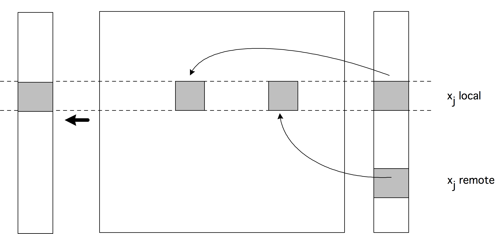
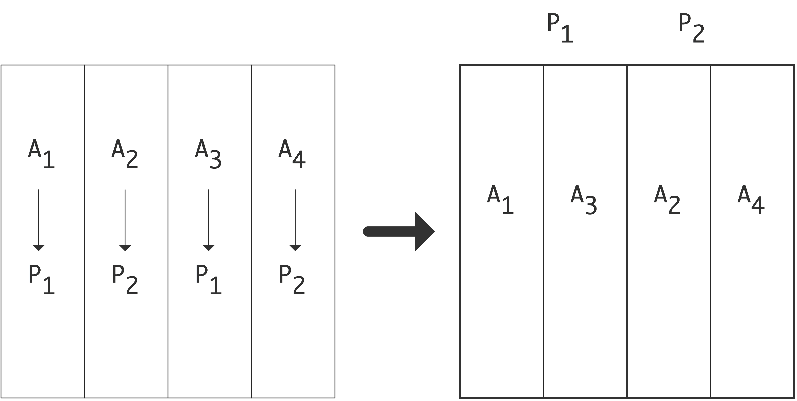
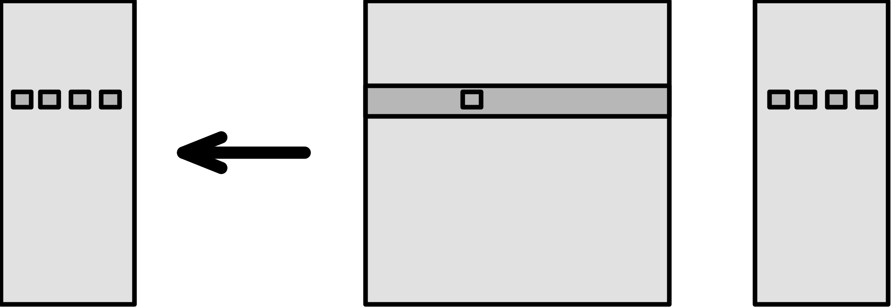
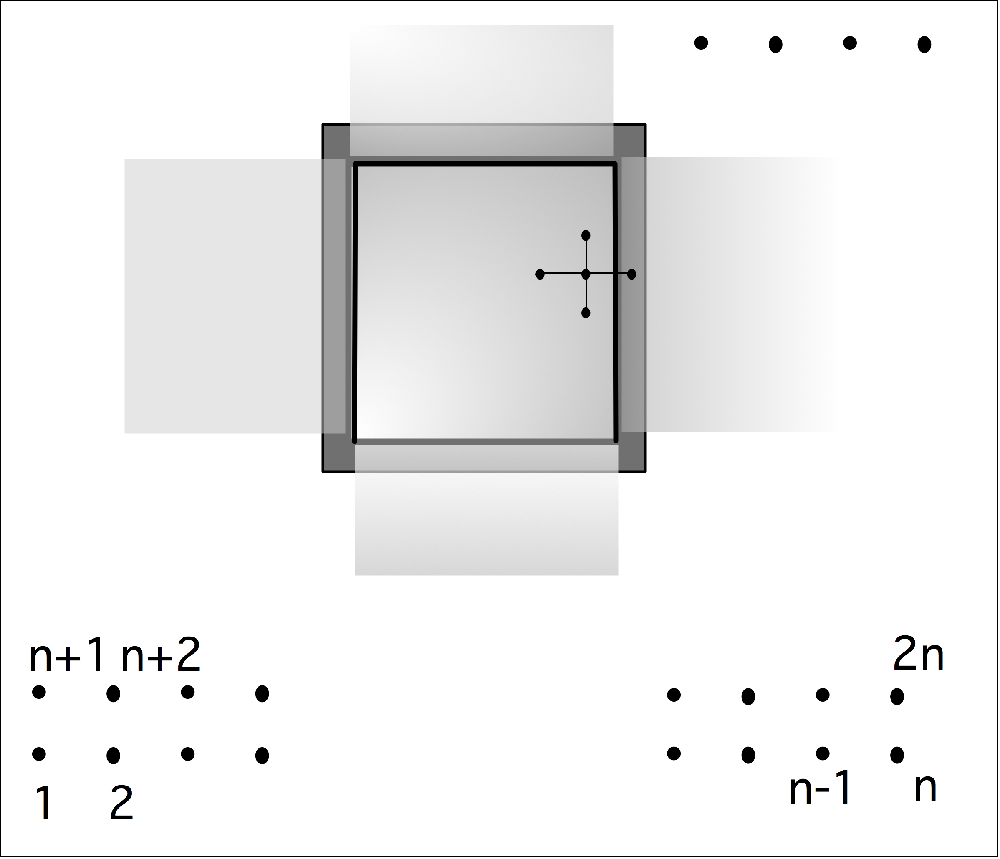

# 高性能的线性代数(一)

在本节中，我们将讨论与并行计算机上的线性代数有关的一些问题。我们将从现实的角度来看待这个问题，假设处理器的数量是有限的，而且相对于处理器的数量，问题数据总是很大。我们还将关注处理器之间通信网络的物理方面。

我们将分析各种线性代数操作，包括迭代方法，以及它们在具有有限带宽和有限连接的网络中的行为。本章最后将对由于并行执行而产生的算法中的复杂问题进行各种简短的评论。

## 集体行动

集合运算在线性代数运算中起着重要的作用。事实上，操作的可扩展性可以取决于这些集合运算的成本，你将在下面看到。在此，我们对其基本思想做一个简短的讨论；详情请见[28]。

在计算集体操作的成本时，三个架构常数足以给出下限。$\alpha$，发送单个消息的时间；$\beta$，发送数据的时间的倒数（见1.3.2节）；以及$\gamma$，执行算术运算的时间的倒数。因此，发送$n$数据项需要时间$\alpha+\beta n $。我们进一步假设，一个处理器一次只能发送一条信息。我们对处理器的连接性不做任何假设；因此，这里得出的下限将适用于广泛的架构。

上述架构模型的主要含义是，在算法的每一步中，活动处理器的数量只能增加一倍。例如，要做一个广播，首先处理器0向1发送，然后0和1可以向2和3发送，然后0-3向4-7发送，等等。这种信息的级联被称为处理器网络的最小生成树，由此可见，任何集体算法都有至少$\alpha \log_2p$与累计延迟有关的成本。

### 广播

向𝑝处理器广播至少需要$\lceil \log_2p\rceil$步，总延迟为$\lceil \log_2p\rceil \alpha$。由于要发送$n$元素，这至少会增加所有元素离开发送处理器的时间$n\beta $，所以总成本下限为
$$
\lceil\log_2 p\rceil\alpha+n\beta
$$
我们可以用下面的方法来说明生成树的方法。
$$
\begin{array}{|c|ccc|}
\hline & t=1 & t=2 & t=3 \\
\hline p_{0} & x_{0} \downarrow, x_{1} \downarrow, x_{2} \downarrow, x_{3} \downarrow & x_{0} \downarrow, x_{1} \downarrow, x_{2} \downarrow, x_{3} \downarrow & x_{0}, x_{1}, x_{2}, x_{3} \\
p_{1} & & x_{0} \downarrow, x_{1} \downarrow, x_{2} \downarrow, x_{3} \downarrow & x_{0}, x_{1}, x_{2}, x_{3} \\
p_{2} & & & x_{0}, x_{1}, x_{2}, x_{3} \\
p_{3} & & & x_{0}, x_{1}, x_{2}, x_{3} \\
\hline
\end{array}
$$
(在$t=1$时，$p_0$发送至$p_1$；在$t=2$时，$p_0,p_1$发送至$p_2,p_3$) 这个算法的$\log_2 \alpha$项正确，但是处理器0重复发送整个向量。所以带宽成本为$\log_2⋅n\beta $。如果$n$较小，则延迟成本占主导地位，因此我们可以将其描述为一个短矢量的集体操作。下面的算法将广播实现为散点算法和桶状旅算法的结合。首先是散射。
$$
\begin{array}{|c|cccc|}
\hline & t=0 & t=1 & t=2 &t=3\\
\hline p_{0} & x_{0} \downarrow, x_{1} , x_{2} , x_{3}  & x_{0} , x_{1} \downarrow, x_{2} , x_{3}& x_{0}, x_{1}, x_{2} \downarrow , x_{3}& x_{0}, x_{1} , x_{2} , x_{3}  \downarrow \\
p_{1} & & x_{1}  & & \\
p_{2} & & & x_{2} &  \\
p_{3} & & &  &  x_{3} \\
\hline
\end{array}
$$
需要$p-1$条大小为$N/p$的信息，总时间为
$$
T_{scatter}(N,P)=(p-1)\alpha+(p-1)·\frac{N}{P}·beta
$$
然后，水桶队让每个处理器在每一步都处于活动状态，接受部分信息（除了第一步），并将其传递给下一个处理器。
$$
\begin{array}{|c|ccc|}
\hline & t=0 & t=1 & 𝑒𝑡𝑐𝑒𝑡𝑒𝑟𝑎 \\
\hline p_{0} & x_{0} \downarrow \quad \quad \quad \quad &\quad  x_{0}  &x_{3}\downarrow \quad \quad \ \ \ \ x_0, \ \ \ \ \quad x_2,x_3\\

p_{1} &  \quad  x_{1} \downarrow \quad \quad \quad &\quad \quad \quad  x_{0} \downarrow, x_{1}  &\quad \quad \quad \quad \ \ \ \ x_{0},  x_{1}, \quad \ \ \ \  x_{3} \\

p_{2} &\quad \quad  x_{2}\downarrow  \quad \quad &\quad \quad \quad \quad \quad \quad \quad  x_{1} \downarrow, x_{2} & \quad \quad \quad \quad  x_{0}, x_{1}, x_{2} \\

p_{3} & \quad \quad \quad x_{3} \downarrow& \quad \quad \quad \quad \quad \quad \quad \quad \quad \quad \quad \quad  x_{2} \downarrow, x_{3} & \quad \quad \quad \quad   \quad \quad \quad  \  x_{1}, x_{2}, x_{3} \\

\hline
\end{array}
$$
每个部分信息被发送$p - 1$次，所以这个阶段的复杂度也是
$$
T_{bucket}(N,P)=(p-1)\alpha+(p-1)·\frac{N}{P}·beta
$$
现在的复杂性变成了
$$
2(p-1)\alpha+2\beta n(p-1)/p
$$
在延迟方面并不理想，但如果$n$较大，则是一种较好的算法，使之成为一种长矢量集体操作。

### Reduction

在还原操作中，每个处理器都有$n$数据元素，一个处理器需要将它们进行元素组合，例如计算$n$的和或积。

通过在时间上向后运行广播，我们看到还原操作的通信下限同样为$\lceil \log_2p\rceil \alpha+n\beta $。缩减操作也涉及到计算，按顺序计算总时间为$(p-1)\gamma n$中的每个项目都在$p$处理器上被缩减。由于这些操作有可能被并行化，因此计算的下限$\frac{(p-1)}{p}\gamma n$，总共有
$$
\lceil \log_2p\rceil \alpha+n\beta+\frac{p-1}{p}\gamma n.
$$
我们举例说明生成树算法，使用符号$x^{(j)}_i$表示最初在处理器$j$上的数据项$i$，而$x_i$表示处理器$j...k$的项目之和。
$$
\begin{array}{|c|ccc|}
\hline & t=1 & t=2 & t=3 \\
\hline p_{0} & x_{0}^{(0)}, x_{1}^{(0)}, x_{2}^{(0)}, x_{3}^{(0)} & x_{0}^{(0: 1)}, x_{1}^{(0: 1)}, x_{2}^{(0: 1)}, x_{3}^{(0: 1)} & x_{0}^{(0: 3)}, x_{1}^{(0: 3)}, x_{2}^{(0: 3)}, x_{3}^{(0: 3)} \\
p_{1} & x_{0}^{(1)} \uparrow, x_{1}^{(1)} \uparrow, x_{2}^{(1)} \uparrow, x_{3}^{(1)} \uparrow & & \\
p_{2} & x_{0}^{(2)}, x_{1}^{(2)}, x_{2}^{(2)}, x_{3}^{(2)} & x_{0}^{(2: 3)} \uparrow, x_{1}^{(2: 3)} \uparrow, x_{2}^{(2: 3)} \uparrow, x_{3}^{(2: 3)} \uparrow & \\
p_{3} & x_{0}^{(3)} \uparrow, x_{1}^{(3)} \uparrow, x_{2}^{(3)} \uparrow, x_{3}^{(3)} \uparrow & &\\
\hline
\end{array}
$$
在时间$t = 1$时，处理器$p_0$、$p_2$从$p_1$、$p_3$接收，在时间$t= 2$时，$p_0$从$p_2$接收。和上面的广播一样，这个算法没有达到下限；相反，它的复杂度为
$$
\lceil \log_2p\rceil(\alpha+n\beta+\frac{p-1}{p}\gamma n)
$$
对于短向量，$\alpha$项占主导地位，所以这个算法就足够了。对于长向量，可以如上所述，使用其他算法[28]。

长向量的减少可以用一个桶状旅，然后用一个聚集来完成。复杂度同上，只是桶队执行部分还原，时间为$\gamma (p-1)N/p$。聚会不进行任何进一步的操作。

### Allreduce

Allreduce操作在每个处理器上对𝑛元素进行同样的元素还原计算，但是将结果留在每个处理器上，而不是仅仅留在生成树的根部。这可以实现为先还原后广播的方式，但是存在更聪明的算法。

值得注意的是，Allreduce的成本下限与简单还原的成本下限几乎相同：因为在还原过程中，并不是所有的处理器都在同一时间活动，我们假设额外的工作可以被完美地分散。这意味着，延迟和计算量的下限保持不变。对于带宽，我们的理由如下：为了使通信完全并行化，$\frac{p-1}{p}n$项目必须到达和离开每个处理器。因此，我们有一个总时间为 
$$
\lceil \log_2p\rceil \alpha+2\frac{p-1}{p}n\beta +\frac{p-1}{p}n\gamma.
$$

### Allgather

在对𝑛元素的聚集操作中，每个处理器都有$n/p$元素，一个处理器将它们全部收集起来，而不像还原操作那样将它们合并。Allgather计算的是同样的集合，但将结果留在所有处理器上。

我们再次假设有多个目标的集合是同时活动的。由于每个处理器都会生成一个最小生成树，因此我们有$\log_2p \alpha$延迟；由于每个处理器从$p-1$个处理器接收$n/p$元素，因此有$(p-1)\times (n/p)\beta$带宽成本。那么，通过allgather构建一个长度为$n$的向量的总成本是
$$
\lceil \log_2p\rceil \alpha+\frac{p-1}{p}n\beta
$$
我们对此进行说明。
$$
\begin{array}{|c|ccc|}
\hline & t=1 & t=2 & t=3 \\
\hline p_{0} & x_{0} \downarrow & x_{0} x_{1} \downarrow & x_{0} x_{1} x_{2} x_{3} \\
p_{1} & x_{1} \uparrow & x_{0} x_{1} \downarrow & x_{0} x_{1} x_{2} x_{3} \\
p_{2} & x_{2} \downarrow & x_{2} x_{3} \uparrow & x_{0} x_{1} x_{2} x_{3} \\
p_{3} & x_{3} \uparrow & x_{2} x_{3} \uparrow & x_{0} x_{1} x_{2} x_{3} \\
\hline
\end{array}
$$
在时间$t = 1$时，邻居$p_0$,$p_1$和同样的𝑝2,𝑝3之间有一个交换；在$t = 2$时，$p_0$,$p_2$和同样的$p_1,p_3$之间有两个距离的交换。

### Reduce-scatter

在reduce-scatter操作中，每个处理器都有$n$元素，并对它们进行$n$方式的还原。与reduce或allreduce不同的是，结果会被分解，并像散点操作那样进行分配。

形式上，处理器𝑖有一个项目$x^{(i)}$，它需要$\sum_jx_i^{(j)}$。我们可以通过做大小$p$的缩减来实现，在一个处理器上收集向量$(\sum_ix_0^{(i)}, \sum_ix_1^{(i)},...)$，并将结果散布出去。然而，有可能在所谓的双向交换算法中结合这些操作。
$$
\begin{array}{|c|ccc|}
\hline & t=1 & t=2 & t=3 \\
\hline p_{0} & x_{0}^{(0)}, x_{1}^{(0)}, x_{2}^{(0)}, x_{3}^{(0)} & x_{0}^{(0: 2:2)} , x_{1}^{(0: 2:2)} \downarrow \quad \quad  \quad \quad \quad \quad & x_{0}^{(0: 3)} \quad \quad \quad \quad \quad \quad\\

p_{1} & x_{0}^{(1)} , x_{1}^{(1)} , x_{2}^{(1)} \downarrow, x_{3}^{(1)} \downarrow &x_{0}^{(1:3:2)}\uparrow  , x_{1}^{(1:3:2)} \quad \quad \quad \quad \quad \quad& \quad x_{1}^{(0: 3)} \quad \quad \quad \quad \quad \\

p_{2} & x_{0}^{(2)} \uparrow, x_{1}^{(2)} \uparrow , x_{2}^{(2)}, x_{3}^{(2)} & \quad \quad \quad \quad \quad \quad x_{2}^{(0:2:2)} , x_{3}^{(0:2:2)} \downarrow &\quad \quad  x_{2}^{(0: 3)} \quad \quad \quad \quad\\

p_{3} & x_{0}^{(3)} \uparrow, x_{1}^{(3)} \uparrow, x_{2}^{(3)} , x_{3}^{(3)}  & \quad \quad \quad \quad \quad \quad x_{0}^{(1:3:2)}\uparrow  , x_{1}^{(1:3:2)}& \quad \quad \quad  x_{3}^{(0: 3)} \quad \quad \\
\hline
\end{array}
$$
reduce-scatter可以被认为是一个反向的allgather运行，加上算术，所以成本是
$$
\lceil \log_2p\rceil \alpha+\frac{p-1}{p}n(\beta +\gamma)
$$

## 并行密集型矩阵-向量乘积

在本节中，我们将详细讨论并行密集矩阵-向量乘积的性能，特别是可扩展性。首先，我们将考虑一个简单的案例，并在一定程度上详细讨论并行性方面。

### 实现块状行的情况

在设计一个算法的并行版本时，人们常常通过对相关对象进行数据分解来进行。在矩阵-向量运算的情况下，例如乘积$y=Ax$，我们可以选择从向量分解开始，并探索其对如何分解矩阵的影响，或者从矩阵开始，并从它推导出向量分解。在这种情况下，似乎很自然地从分解矩阵开始，而不是从分解矢量开始，因为它很可能具有更大的计算意义。我们现在有两个选择。

1. 我们对矩阵进行一维分解，将其分割成块状行或块状列，并将其中的每一个--或每一组--分配给一个处理器。

2. 或者，我们可以进行二维分解，将一个或多个一般子矩阵分配给每个处理器。

我们首先考虑以块行的方式进行分解。考虑一个处理器$p$和它所拥有的行的索引集合$I_p$，并让$i \in I_p$是分配给这个处理器的行。行中的元素$i$被用于操作
$$
y_i = \sum_{j}a_{ij}x_j
$$
我们现在推理。

- 如果处理器$p$拥有所有$x_j$的值，那么矩阵-向量乘积就可以简单地执行，完成后，处理器拥有正确的值$y_j\in I_p$。

- 这意味着每个处理器都需要有一个$x$的副本，这是很浪费的。同时，这也提出了数据完整性的问题：你需要确保每个处理器都有正确的$x$的值。

- 在某些实际应用中（例如你之前看到的迭代方法），矩阵-向量乘积的输出直接或间接地成为下一个矩阵-向量操作的输入。对于计算$x、Ax、A^2x、....$ 的功率法来说，情况当然是这样的。由于我们的操作开始时每个处理器拥有整个$x$，但结束时它只拥有$Ax$的局部部分，所以我们有一个不匹配。
- 也许我们应该假设每个处理器在操作开始时只拥有$x$的局部部分，也就是那些$i \in I_p$的$x$，这样，算法的开始状态和结束状态是一样的。这意味着我们必须改变算法，包括一些通信，使每个处理器能够获得那些$x_i \notin I_p$的值。


**练习 6.1**  对矩阵被分解成块列的情况进行类似的推理。像上面一样，详细描述并行算法，但不要给出伪代码。

现在让我们来看看通信的细节：我们将考虑一个固定的处理器$p$，并考虑它执行的操作和需要的通信。根据上述分析，在执行语句$y_i = \sum_j a_{ij}x_j$时，我们必须知道$j$值属于哪个处理器。为了确认这一点，我们写道
$$
y_i = \sum_{j\in I_p}a_{ij}x_j+\sum_{j\notin I_p}a_{ij}x_j
$$
如果$j \in I_p$，指令$y_i \leftarrow y_i + a_{ij}x_j$只涉及已经属于处理器的量。因此，让我们集中讨论$j\notin I_p$的情况。 如果我们可以直接写出这样的语句就好了

```c
 y(i) = y(i) + a(i,j)*x(j)
```

而一些下层将自动把$x^{(j)}$从它所存储的任何处理器转移到本地寄存器。(2.6.5节的PGAS语言旨在做到这一点，但它们的效率远不能保证)。图6.1给出了一个基于这种乐观的并行性观点的实现。

这种 "局部 "方法的直接问题是会有太多的通信发生。

- 如果矩阵$A$是密集的，那么每一行$i \in I_p$都需要一次元素$x_j$，因此每一行$i \in I_p$都将被取走一次。
- 对于每个处理器$q\neq p$，将有（很大）数量的元素$x_j \in I_q$ 需要从处理器$q$转移到$p$。 在不同的信息中做这些，而不是一次批量传输，是非常浪费的。




对于共享内存来说，这些问题并不是什么大问题，但在分布式内存的背景下，最好采取缓冲的方式。

我们不需要交流𝑥的各个元素，而是为每个处理器$B_{pq}\neq p$使用一个本地缓冲区，我们从$q$收集需要在$p$上执行乘法的元素。 (见图6.2的说明。)图6.3给出了并行算法。 除了防止一个元素被取走超过一次之外，这也将许多小的消息合并成一个大的消息，这通常更有效率；回顾我们在2.7.8节中对带宽和延迟的讨论。 

**练习 6.2** 给出使用非阻塞操作的矩阵-向量乘积的伪码(第2.6.3.6节) 上面我们说过，在每个处理器上都有一份整个𝑥的副本，这是对空间的浪费。 

这里隐含的论点是，一般来说，我们不希望本地存储是处理器数量的函数：理想情况下，它应该只是本地数据的函数。 (这与弱缩放有关；第2.2.5节。) 你看，由于通信方面的考虑，我们实际上已经决定，每个处理器存储整个输入向量是不可避免的，或者至少是最好的。 这种空间和时间效率之间的权衡在并行编程中相当普遍。 对于密集的矩阵-向量乘积，我们实际上可以为这种开销辩护，因为向量存储的顺序比矩阵存储的顺序要低，所以我们的过度分配比例很小。 下面（第6.5节），我们将看到，对于稀疏矩阵-向量乘积，开销会小很多。 

我们很容易看到，如果允许我们忽略通信时间，那么上面描述的并行密集矩阵-向量乘积就有完美的加速。 在接下来的几节中，你会发现如果我们考虑到通信，上面的块行实现并不是最佳的。 对于可扩展性，我们需要一个二维分解。 我们先来讨论一下集合体。

### 密集矩阵-向量乘积的可扩展性

在本节中，我们将对$y \leftarrow Ax$的并行计算进行全面分析，其中$x,y \in \mathbb{R}^n$和$A\in \mathbb{R}^{n \times n}$。我们将假设使用$p$节点，但我们对它们的连接性不做任何假设。我们将看到，矩阵的分布方式对算法的缩放有很大的影响；原始研究见[101, 180, 188]，各种缩放形式的定义见2.2.5节。

#### 矩阵-向量乘积，按行划分

划分
$$
A \rightarrow\left(\begin{array}{c}
A_{0} \\
A_{1} \\
\vdots \\
A_{p-1}
\end{array}\right) \quad x \rightarrow\left(\begin{array}{c}
x_{0} \\
x_{1} \\
\vdots \\
x_{p-1}
\end{array}\right), \quad \text { and } \quad y \rightarrow\left(\begin{array}{c}
y_{0} \\
y_{1} \\
\vdots \\
y_{p-1}
\end{array}\right)
$$
其中，$A_i\in \mathbb{R}^{m_i\times n}$且$x_i,y_i\in \mathbb{R}^{m_i}$，$\sum_{i=0}^{p-1}m_i=n$和$m_i\approx n/p$。我们将首先假设$A_i, x_i y_i$和最初被分配的$P_i$。

计算的特点是，每个处理器需要整个向量$x$，但只拥有其中的$n/p$部分。因此，我们对$x$进行了一次全集。之后，处理器可以执行本地产品$y_i \leftarrow A_ix$；此后不需要进一步的通信。

那么，一个对$y = Ax$进行成本计算的算法就可以通过以下方式得到
$$
\begin{array}{|l|l|}
\hline \text { Step } & \text { Cost (lower bound) } \\
\hline \begin{array}{l}
\text { Allgather } x_{i} \text { so that } x \text { is available } \\
\text { on all nodes }
\end{array} & \left\lceil\log _{2}(p) \mid \alpha+\frac{p-1}{p} n \beta \approx \log _{2}(p) \alpha+n \beta\right. \\
\text { Locally compute } y_{i}=A_{i} x & \approx 2 \frac{n^{2}}{p} \gamma \\
\hline
\end{array}
$$
成本分析 算法的总成本约为。
$$
T_{p}(n)=T_{p}^{1 \mathrm{D}-\mathrm{row}}(n)=2 \frac{n^{2}}{p} \gamma+\underbrace{\log _{2}(p) \alpha+n \beta}_{\text {Overhead }}
$$
由于顺序成本为$T_1(n)=2n^2\gamma $，所以速度提升为
$$
S_{p}^{1 \mathrm{D}-\operatorname{row}}(n)=\frac{T_{1}(n)}{T_{p}^{1 \mathrm{D}-\mathrm{row}}(n)}=\frac{2 n^{2} \gamma}{2 \frac{n^{2}}{p} \gamma+\log _{2}(p) \alpha+n \beta}=\frac{p}{1+\frac{p \log _{2}(p)}{2 n^{2}} \frac{\alpha}{\gamma}+\frac{p}{2 n} \frac{\beta}{\gamma}}
$$
和并行效率，由
$$
E_{p}^{1 \mathrm{D}-\mathrm{row}}(n)=\frac{S_{p}^{1 \mathrm{D}-\mathrm{row}}(n)}{p}=\frac{1}{1+\frac{p \log _{2}(p)}{2 n^{2}} \frac{\alpha}{\gamma}+\frac{p}{2 n} \frac{\beta}{\gamma}}
$$
一个乐观主义者的观点 现在，如果我们固定$p$，并让$n$变得很大
$$
\lim _{n \rightarrow \infty} E_{p}(n)=\lim _{n \rightarrow \infty}\left[\frac{1}{1+\frac{p \log _{2}(p)}{2 n^{2}} \frac{\alpha}{\gamma}+\frac{p}{2 n} \frac{\beta}{\gamma}}\right]=1
$$
因此，如果能使问题足够大，最终的并行效率几乎是完美的。然而，这是以无限内存为前提的，所以这种分析并不实用。

悲观者的观点 在强可扩展性分析中，我们固定$n$，让$p$变大，以得到
$$
\lim _{p \rightarrow \infty} E_{p}(n)=\lim _{p \rightarrow \infty}\left[\frac{1}{1+\frac{p \log _{2}(p)}{2 n^{2}} \frac{\alpha}{\gamma}+\frac{p}{2 n} \frac{\beta}{\gamma}}\right]=0
$$
因此，最终并行效率变得几乎不存在了。

现实主义者的观点 在一个更现实的观点中，我们随着数据量的增加而增加处理器的数量。这被称为弱可扩展性，它使可用于存储问题的内存量与$p$成线性比例。

让$M$等于可以存储在单个节点的内存中的浮点数。那么总内存由$Mp$给出。让$n_{max}(p)$等于在$p$节点的总内存中可以存储的最大问题大小。那么，如果所有内存都可以用于矩阵。
$$
\left(n_{\max }(p)\right)^{2}=M p \text { or } n_{\max }(p)=\sqrt{M p}
$$
现在的问题是，对于可以存储在$p$节点上的最大问题，其并行效率如何。
$$
\begin{aligned}
E_{p}^{1 \mathrm{D}-\mathrm{row}}\left(n_{\max }(p)\right) &=\frac{1}{1+\frac{p \log _{2}(p)}{2\left(n_{\max }(p)\right)^{2}} \frac{\alpha}{\gamma}+\frac{p}{2 n_{\max }(p)} \frac{\beta}{\gamma}} \\
&=\frac{1}{1+\frac{\log _{2}(p)}{2 M} \frac{\alpha}{\gamma}+\frac{\sqrt{p}}{2 \sqrt{M}} \frac{\beta}{\gamma}}
\end{aligned}
$$
现在，如果分析一下当节点数量变得很大时发生了什么，就会发现
$$
\lim _{p \rightarrow \infty} E_{p}\left(n_{\max }(p)\right)=\lim _{p \rightarrow \infty}\left[\frac{1}{1+\frac{\log _{2}(p)}{2 M} \frac{\alpha}{\gamma}+\frac{\sqrt{p}}{2 \sqrt{M}} \frac{\beta}{\gamma}}\right]=0
$$
因此，这种矩阵-向量乘法的并行算法并没有规模。

如果你仔细看一下这个效率表达式，你会发现主要问题是表达式中的$1/\sqrt{p}$部分。这个条款涉及到一个系数$\beta$，如果你跟着推导往后看，你会发现它来自处理器之间发送数据的时间。非正式地说，这可以被描述为消息大小太大，使问题可扩展。事实上，无论处理器的数量如何，消息大小都是恒定的$𝑛$。

另外，一个现实主义者意识到，完成一个计算的时间是有限的，$T_{max}$。在最好的情况下，即通信开销为零的情况下，我们能在$T_{max}$时间内解决的最大问题为
$$
T_{p}\left(n_{\max }(p)\right)=2 \frac{\left(n_{\max }(p)\right)^{2}}{p} \gamma=T_{\max }
$$
因此
$$
\left(n_{\max }(p)\right)^{2}=\frac{T_{\max } p}{2 \gamma} \text { or } n_{\max }(p)=\frac{\sqrt{T_{\max }} \sqrt{p}}{\sqrt{2 \gamma}}
$$
那么，对于可以在$T_max$时间内解决的最大问题，该算法所达到的并行效率为
$$
E_{p, n_{\max }}=\frac{1}{1+\frac{\log _{2} p}{T} \alpha+\sqrt{\frac{p}{T} \frac{\beta}{\gamma}}}
$$
而当节点数变多时，其并行效率接近
$$
\lim _{p \rightarrow \infty} E_{p}=\sqrt{\frac{T \gamma}{p \beta}}
$$
同样，随着处理器数量的增加和执行时间的上限，效率也无法维持。

我们也可以计算出这个操作的等效率曲线，即$n$，$p$之间的关系，对于这个关系，效率保持不变（见 2.2.5.1 节）。如果我们将上述效率简化为 $E(n,p)=\frac{2\gamma}{\beta} \frac{n}{p}$，则$E\equiv c$相当于$n=O(p)$，因此
$$
M=O(\frac{n^2}{p})=O(p)
$$
因此，为了保持效率，我们需要相当快地增加每个处理器的内存。这是有道理的，因为这淡化了通信的重要性。

#### 矩阵-向量乘积，按列划分

划分
$$
A \rightarrow\left(A_{0}, A_{1}, \ldots, A_{p-1}\right) \quad x \rightarrow\left(\begin{array}{c}
x_{0} \\
x_{1} \\
\vdots \\
x_{p-1}
\end{array}\right), \quad \text { and } \quad y \rightarrow\left(\begin{array}{c}
y_{0} \\
y_{1} \\
\vdots \\
y_{p-1}
\end{array}\right)
$$
其中 $A_{j} \in \mathbb{R}^{n \times n_{j}}$， $x_{j}, y_{j} \in \mathbb{R}^{n_{j}}$ 在$\sum_{j=0}^{p-1} n_{j}=n$，$ n_{j} \approx n / p$. 

我们将首先假设$A_j$、$x_j$和$y_j$最初被分配给$P_j$（但现在$A_i$是一个列块）。在这种按列计算的算法中，处理器𝑖可以计算长度$n$向量$A_ix_i$，而不需要事先沟通。然后，这些部分结果必须被加在一起
$$
y \leftarrow \sum_i A_ix_i
$$
每个处理器$i$将其结果的一部分$(A_ix_i)_j$分散到处理器$j$中。然后，接收的处理器进行还原，将所有这些片段相加。
$$
y_j = \sum_i (A_i x_i)_j.
$$
然后，有成本的算法由以下方式给出。
$$
\begin{array}{|l|l|}
\hline \text { Step } & \text { Cost (lower bound) } \\
\hline \text { Locally compute } y^{(j)}=A_{j} x_{j} & \approx 2 \frac{n^{2}}{p} \gamma \\
\text { Reduce-scatter the } y^{(j)} \text { s so that } y_{i}=\sum_{j=0}^{p-1} y_{i}^{(j)} \text { is on } P_{i} & \begin{array}{l}
\lceil \log _{2}(p) \rceil \alpha+\frac{p-1}{p} n \beta+\frac{p-1}{p} n \gamma \\
\approx \log _{2}(p) \alpha+n(\beta+\gamma)
\end{array} \\
\hline
\end{array}
$$
**成本分析** 算法的总成本约为。
$$
T_{p}^{1 \mathrm{D}-\mathrm{col}}(n)=2 \frac{n^{2}}{p} \gamma+\underbrace{\log _{2}(p) \alpha+n(\beta+\gamma)}_{\text {Overhead }}
$$
请注意，这与成本𝑇 1D-row(𝑛)是相同的，只是将𝛽替换为（𝛽 + 𝛾）。不难看出关于可扩展性的结论是相同的。

#### 二维划分

下面，划分
$$
A \rightarrow\left(\begin{array}{cccc}
A_{00} & A_{01} & \ldots & A_{0, p-1} \\
A_{10} & A_{11} & \ldots & A_{1, p-1} \\
\vdots & \vdots & \ddots & \vdots \\
A_{p-1,0} & A_{p-1,0} & \ldots & A_{p-1, p-1}
\end{array}\right) \quad x \rightarrow\left(\begin{array}{c}
x_{0} \\
x_{1} \\
\vdots \\
x_{p-1}
\end{array}\right), \quad \text { and } \quad y \rightarrow\left(\begin{array}{c}
y_{0} \\
y_{1} \\
\vdots \\
y_{p-1}
\end{array}\right)
$$
其中，$A_{i j} \in \mathbb{R}^{n_{i} \times n_{j}}$ ，$x_{i}, y_{i} \in \mathbb{R}^{n_{i}}$，$\sum_{i=0}^{p-1} n_{i}=N$， $n_{i} \approx N / \sqrt{P}$ .

我们将以$r\times c$网格的形式来看待节点，其中$P=rc$，并以$p_{ij}$的形式来看待，其中$i=0, ..., r-1$和$j=0, ... , c- 1$. 图6.4，对于3×4处理器网格上的12×12矩阵，说明了数据对节点的分配，其中$i, j$ "单元 "显示了$p_{ij}$拥有的矩阵和向量元素。


换句话说，$p_{ij}$拥有矩阵块$A_j$以及$x$和$y$的一部分。这使得以下算法成为可能

算法：

- 由于$x_j$分布在第𝑗列，该算法首先在每个处理器$p_{ij}$上通过处理器列内的allgather收集$x_j$。

- 每个处理器$p_{ij}$然后计算$y_{ij}=A_{ij}x_j$ 。这不涉及进一步的沟通。

- 然后，通过将每个处理器行中的碎片$y_i$收集起来，形成$y_i$，然后将其分布在处理器行中，从而得到结果$y_i$。这两个操作实际上是结合在一起的形成一个还原散射。

- 如果$r=c$，我们可以在处理器上对$y$数据进行转置，这样它就可以作为后续矩阵向量乘法的输入随后的矩阵-向量乘积。另一方面，如果我们正在计算$AA^tx$，那么$y$现在可以正确地分配给$A^t$乘积。


**算法** 带有成本分析的算法是
$$
\begin{array}{|l|l|}
\hline \text { Step } & \text { Cost (lower bound) } \\
\hline \text { Allgather } x_{i} \text { 's within columns } & \left\lceil\log _{2}(r) \rceil \alpha+\frac{r-1}{p} n \beta\right. \\
& \approx \log _{2}(r) \alpha+\frac{n}{c} \beta \\
\text { Perform local matrix-vector multiply } & \approx 2 \frac{n^{2}}{p} \gamma \\
\text { Reduce-scatter } y_{i} \text { 's within rows } & {\left[\log _{2}(c)\right] \alpha+\frac{c-1}{p} n \beta+\frac{c-1}{p} n \gamma} \\
& \approx \log _{2}(c) \alpha+\frac{n}{c} \beta+\frac{n}{c} \gamma \\
\hline
\end{array}
$$
**成本分析** 算法的总成本约为。
$$
T_{p}^{r \times c}(n)=T_{p}^{r \times c}(n)=2 \frac{n^{2}}{p} \gamma+\underbrace{\log _{2}(p) \alpha+\left(\frac{n}{c}+\frac{n}{r}\right) \beta+\frac{n}{r} \gamma}_{\text {Overhead }}
$$
现在我们将进行简化，即$r=c=\sqrt{p}$，所以
$$
T_{p}^{\sqrt{p} \times \sqrt{p}}(n)=T_{p}^{\sqrt{p} \times \sqrt{p}}(n)=2 \frac{n^{2}}{p} \gamma+\underbrace{\log _{2}(p) \alpha+\frac{n}{\sqrt{p}}(2 \beta+\gamma)}_{\text {Overhead }}
$$
由于顺序成本为$T_1(n)=2n^2\gamma$，所以速度提升为
$$
S_{p}^{\sqrt{p} \times \sqrt{p}}(n)=\frac{T_{1}(n)}{T_{p}^{\sqrt{p} \times \sqrt{p}}(n)}=\frac{2 n^{2} \gamma}{2 \frac{n^{2}}{p} \gamma+\frac{n}{\sqrt{p}}(2 \beta+\gamma)}=\frac{p}{1+\frac{p \log _{2}(p)}{2 n^{2}} \frac{\alpha}{\gamma}+\frac{\sqrt{p}}{2 n} \frac{(2 \beta+\gamma)}{\gamma}}
$$
和并行效率，由
$$
E_{p}^{\sqrt{p} \times \sqrt{p}}(n)=\frac{1}{1+\frac{p \log _{2}(p)}{2 n^{2}} \frac{\alpha}{\gamma}+\frac{\sqrt{p}}{2 n} \frac{(2 \beta+\gamma)}{\gamma}}
$$
我们再次提出一个问题，对于可以存储在$p$的最大问题，其并行效率是多少？节点的最大问题的并行效率是多少。
$$
\begin{aligned}
E_{p}^{\sqrt{p} \times \sqrt{p}}\left(n_{\max }(p)\right) &=\frac{1}{1+\frac{p \log _{2}(p)}{2 n^{2}} \frac{\alpha}{\gamma}+\frac{\sqrt{p}}{2 n} \frac{(2 \beta+\gamma)}{\gamma}} \\
&=\frac{1}{1+\frac{\log _{2}(p)}{2 M} \frac{\alpha}{\gamma}+\frac{1}{2 \sqrt{M}} \frac{(2 \beta+\gamma)}{\gamma}}
\end{aligned}
$$
以至于
$$
\lim _{p \rightarrow \infty} E_{p}^{\sqrt{p} \times \sqrt{p}}\left(n_{\max }(p)\right)=\lim _{p \rightarrow \infty} \frac{1}{1+\frac{\log _{2}(p)}{2 M} \frac{\alpha}{\gamma}+\frac{1}{2 \sqrt{M}} \frac{(2 \beta+\gamma)}{\gamma}}=0
$$
然而，$\log_2p$随$p$的增长非常缓慢，因此被认为很像一个常数。在这种情况下，$E_p^{\sqrt{p}\times \sqrt{p}}(n_{max}(p))$下降的速度非常慢，而且该算法被认为是可扩展的，以满足实际需要。

请注意，当$r=p$时，二维算法成为 "按行划分 "的算法，而当$c=p$时，则成为 "按列划分 "的算法。不难看出，只要$r/c$保持不变，当$r=c$时，2D算法在上述分析的意义上是可扩展的。

**练习 6.3** 计算这个操作的等效率曲线。

## 并行LU因子化

矩阵-向量和矩阵-乘积在某种意义上是很容易并行化的。输出的元素都可以独立地以任何顺序计算，所以我们在算法的并行化方面有很多自由度。这对于计算LU因子化或用因子化的矩阵求解线性系统来说并不成立。

### 解决一个三角形系统

三角系统$y=L^{-1}x$ （其中$L$为下三角）的解是一个矩阵-向量运算，因此它与矩阵-向量乘积有其𝑂(𝑁2)的共同复杂性。然而，与乘积运算不同的是，这个求解过程包含了输出元素之间的递推关系。
$$
y_{i}=\ell_{i i}^{-1}\left(x_{i}-\sum_{j<i} \ell_{i j} x_{j}\right)
$$
这意味着并行化并非易事。在稀疏矩阵的情况下，可能会有特殊的策略；见6.10节。在这里，我们将对一般的稠密情况做一些评论。

为了简单起见，我们假设通信不需要时间，而且所有的算术运算都需要相同的单位时间。首先，我们考虑按行分布的矩阵，也就是说，处理器$p$存储的元素$\ell_{p*}$。有了这个，我们可以把三角解法实现为：

- 处理器1解决了$t_1=\ell_{11}^{-1}x_1$，并将其值发送给下一个处理器。
- 一般来说，处理器$p$得到的值是$y_1,...,y_{p-1}$来自处理器$p-1$，并计算出$y_p$。 
- 然后每个处理器$p$将$y_1,...,y_p$发送给$p + 1$。

**练习 6.4** 证明这个算法需要时间$2N^2$，就像顺序算法一样。

这个算法中，每个处理器以流水线的方式将所有计算过的𝑦𝑖值传递给它的后继者。然而，这意味着处理器$p$在最后一刻才收到$y_1$，而这个值在第一步已经被计算出来了。我们可以以这样的方式来制定解决算法，使计算的元素尽快被提供出来。

- 处理器1解决$y_1$，并将其发送给所有后来的处理器。
- 一般来说，处理器$p$会等待值为$y_q$的个别消息，因为$q<p$。
- 然后，处理器$p$计算$y_p$，并将其发送给处理器$q$，而$q > p$。

在通信时间可以忽略不计的假设下，这个算法可以快很多。对于在$p>1$的所有处理器都同时收到$y_1$，并能同时计算$\ell_{p1}y_1$。

**练习 6.5** 说明如果我们不考虑通信，这个算法变体需要的时间是$O(N)$。如果我们将通信纳入成本，那么成本是多少？

**练习 6.6** 现在考虑按列分布的矩阵：处理器$𝑝$p储存$\ell_{*p}$ 。概述这种分布下的三角解算法，并说明并行解的时间是$O(N)$。

### 因式分解，密集型情况

对并行密集$LU$分解的可扩展性的全面分析是相当复杂的，所以我们将声明，无需进一步证明，正如在矩阵-向量的情况下，需要一个二维分布。然而，我们可以发现一个进一步的复杂情况。由于任何类型的因式分解3都是通过矩阵进行的，处理器在部分时间内是不活动的。

**练习 6.7** 考虑有规律的右看高斯消除法

```c
for k=1..n
  p = 1/a(k,k)
  for i=k+1,n
    for j=k+1,n
      a(i,j) = a(i,j)-a(i,k)*p*a(k,j)
```

分析运行时间、加速和效率与$N$的函数关系，如果我们假设有一个一维分布，并且有足够的处理器为每个处理器存储一列。表明提速是有限的。也对二维分解进行这种分析，每个处理器存储一个元素。

由于这个原因，使用了过度分解，矩阵被分成比处理器数量更多的块，每个处理器存储几个不相邻的子矩阵。我们在图6.5中说明了这一点，我们将一个矩阵的四个块列划分给两个处理器：每个处理器在一个连续的内存块中存储两个非连续的矩阵列。

接下来，我们在图6.6中说明，在不知道处理器存储了矩阵的非连续部分的情况下，可以对这样的矩阵进行矩阵-向量乘积。只需要输入的向量也是循环分布的。

练习6.8. 现在考虑一个4×4的矩阵和一个2×2的处理器网格。矩阵的行和列都是循环分布的。说明只要输入分布正确，如何使用连续的矩阵存储来进行矩阵-向量乘积。输出是如何分布的？说明比起一维例子的还原，需要更多的通信。

具体来说，在$P<N$处理器的情况下，为简单起见，假设$N=cP$，我们让处理器0存储行0，c，2c，3c，...；处理器1存储行1，c+1，2c+1，...等。这个方案可以概括为二维分布，如果$N=c_1P_1=c_2P_2$和$P=P_1P_2$。这被称为二维循环分布。这个方案可以进一步扩展，考虑块的行和列（块的大小较小），将块的行0，c，2c，....，分配给处理器0。




**练习 6.9** 考虑一个正方形$n\times n$矩阵，以及一个正方形$p\times p$处理器网格，其中$p$除以$n$无余。考虑上述的过度分解，并对$n=6$，$p=2$的特定情况下的矩阵元素分配做一个草图。也就是说，画一个$n\times n$表，其中位置$（i, j）$包含存储相应矩阵元素的处理器编号。同时，为每个处理器制作一个表格，描述局部到全局的映射，即给出局部矩阵中元素的全局$（i, j）$坐标。(你会发现使用零基编号可以方便地完成这项任务。现在写出$i,j$ 的函数$P,Q,I,J$，描述全局到局部的映射，即矩阵元素$a_{ij}$被存储在处理器$(P(i, j), Q(i, j))$的$(I(i,j),J(i,j))$位置上 。

### 因式分解，稀疏情况

稀疏矩阵$LU$因式分解是一个众所周知的难题。任何类型的因式分解都涉及到顺序部分，这使得它从一开始就不是简单的事情。为了了解稀疏情况下的问题，假设你按顺序处理矩阵的行。密集情况下，每行有足够多的元素，可以在那里衍生出并行性，但是在稀疏情况下，这个数字可能非常低。

解决这个问题的方法是认识到我们对因式分解本身不感兴趣，而是我们可以用它来解决一个线性系统。由于对矩阵进行置换可以得到相同的解，也许本身就是置换过的，所以我们可以探索具有更高平行度的置换。

矩阵排序的话题已经在第5.4.3.5节中出现了，其动机是填空式还原。我们将在下面考虑具有有利的并行性的排序：第6.8.1节中的嵌套剖析，以及第6.8.2节中的多色排序。

## 矩阵-矩阵乘积

矩阵三乘法$C\leftarrow A·B$(或$C\leftarrow A·B+\gamma C$，如基本线性代数子程序(BLAS)中使用的那样)有一个简单的并行结构。假设所有大小为$N\times N$的正方形矩阵

- $N^3$内积$a_{ik}b_{kj}$可以分别被独立计算，之后
- $N^2$个元素$c_{ij}$是通过独立的求和还原形成的，每个求和还原的时间为对数$\log_2N$。

然而，更有趣的是数据移动的问题。

- 在$N^3$个操作的$O(N^2)$元素上，有相当多的机会进行数据重用（第1.6.1节）。我们将在第6.4.1节探讨 "Goto算法"。
- 根据矩阵的遍历方式，TLB的重用也需要被考虑（第1.3.8.2节）。
- 矩阵-矩阵乘积的分布式内存版本尤其棘手。假设$A$、$B$、$C$都分布在一个处理器网格上，$A$的元素必须通过一个处理器行，而$B$的元素必须通过一个处理器列。我们在下面讨论 "坎农算法 "和外积法。

### 转到矩阵-矩阵乘积

在第1.6.1节中，我们认为矩阵的矩阵乘积（或BLAS术语中的dgemm）有大量可能的数据重用：在$O(n^3)$数据上有$O(n^2)$操作。现在我们将考虑一个实现，由于Kazushige Goto [85]，它确实达到了接近峰值的性能。

矩阵-矩阵算法有三个循环，每个循环我们都可以屏蔽，从而得到一个六路的嵌套循环。由于输出元素上没有递归，所有产生的循环交换都是合法的。结合这个事实，循环阻塞引入了三个阻塞参数，你会发现潜在实现的数量是巨大的。这里我们介绍了支撑Goto实现的全局推理；详细讨论见所引用的论文。

我们首先将乘积$C\leftarrow A\cdot B$ （或者根据Blas标准，$C\leftarrow C+ A\cdot B$）写成一个低秩更新序列。
$$
C_{**} = \sum_k A_{*k}B_{k*}
$$


为4，通过积累。

```c
// compute C[i,*] :
   for k:
      C[i,*] = A[i,k] * B[k,*]
```

见图6.9。现在这个算法被调整了。

- 我们需要足够的寄存器来处理$C[i,*]$、$A[i,k]$和$B[k,*]$。在目前的处理器上，这意味着我们要积累四个$C$元素。
- $C$的这些元素被积累起来，所以它们停留在寄存器中，唯一的数据转移是对$A$和$B$元素的加载；没有存储！这就是为什么我们要把这些元素放在寄存器中。
- 元素$A[i,k]$和$B[k,*]$来自L1。
- 由于相同的$A$块被用于许多连续的$B$片断，我们希望它保持常驻；我们选择$A$的块大小，让它保持在二级缓存中。
- 为了防止TLB问题，$A$被按行存储。如果我们一开始就用（Fortran）列为主的方式存储矩阵，这意味着我们必须进行复制。由于复制的复杂程度较低，这个成本是可以摊销的。



这种算法可以在专门的硬件中实现，如谷歌的TPU[84]，具有很大的能源效率。

### 坎农的分布式内存矩阵-矩阵乘积算法

在第6.4.1节中，我们考虑了单处理器矩阵-矩阵乘法的高性能实现。现在我们将简要地考虑这一操作的分布式内存版本。(值得注意的是，这并不是基于第6.2节的矩阵-向量乘积算法的泛化）。

这种操作的一种算法被称为坎农算法。它是一个正方形的处理器网格，处理器$（i，j）$逐渐积累$（i，j）$块 $C_{i,j}=\sum_kA_{i,k}B_{k,j}$；见图6.10。

如果你从左上角开始，你会看到处理器（0，0）同时拥有$A_{00}$和$B_{00}$，所以它可以立即开始做一个局部乘法。处理器（0，1）有$A_{01}$和$B_{01}$，它们不需要在一起，但是如果我们把$B$的第二列向上旋转一个位置，处理器（0，1）将有$A_{01}$，$B_{11}$，这两个确实需要被乘以。同样地，我们将$B$的第三列向上旋转两个位置，这样（0，2）就有$A_{02}$，$B_{22$。

这个故事在第二行是如何进行的呢？处理器（1，0）有$A_{10}$，$B_{10}$，它们不需要在一起。如果我们将第二行的$A$向左旋转一个位置，它就包含了$A_{11},B_{10}$，这些是部分内积所需要的。而现在处理器（1,1）有$A_{11},B_{11}$。

如果我们继续这个故事，我们从一个矩阵$A$开始，其中的行已经被向左旋转，而𝐵的列已经被向上旋转。在这个设置中，处理器$（i,j）$包含$A_{i,i+j}$和$B_{i+j,j}$，其中加法是按矩阵大小调制的。这意味着每个处理器都可以从做局部积开始。

现在我们观察到，$C_{ij}=\sum_k A_{ik}B_{kj}$意味着下一个局部积项来自于将𝑘增加1。$A$，$B$的相应元素可以通过旋转行和列的另一个位置移入处理器。


### 分布式矩阵-矩阵乘积的外积法

坎农的算法因需要一个正方形处理器网格的要求而受到影响。外积法更为普遍。它是基于矩阵-矩阵乘积计算的以下安排。

```c
for ( k )
     for ( i )
       for ( j )
         c[i,j] += a[i,k] * b[k,j]
```

也就是说，对于每个$k$，我们取$A$的一列和$B$的一行，并计算秩-1矩阵（或 "外积"）$A_{*,k}\cdot B_{k,*}$。然后我们对$k$求和。

看一下这个算法的结构，我们注意到在步骤$k$中，每一列$j$收到$A_{*,k}$，每一行$i$收到$B_{*,k}$。换句话说，$A_{*,k}$的元素通过他们的行广播，而$B_{*,k}$的元素则通过他们的行广播。

使用MPI库，这些同步广播是通过为每一行和每一列设置一个子通信器来实现的。

## 稀疏的矩阵-向量乘积

在通过迭代方法求解线性系统时（见第5.5节），矩阵-向量乘积在计算上是一个重要的内核，因为它在每次可能的数百次迭代中都要执行。在本节中，我们先看一下矩阵-向量乘积在单处理器上的性能；多处理器的情况将在第6.5节中得到关注。

### 单处理器的稀疏矩阵-向量乘积

在迭代方法的背景下，我们并不太担心密集矩阵-向量乘积的问题，因为人们通常不会对密集矩阵进行迭代。在我们处理块状矩阵的情况下，请参考第1.7.11节对密集积的分析。稀疏乘积就比较麻烦了，因为大部分的分析并不适用。

稀疏矩阵-向量乘积中的数据重用 按行执行的密集矩阵-向量乘积和CRS稀疏乘积（第5.4.1.4节）之间有一些相似之处。在这两种情况下，所有的矩阵元素都是按顺序使用的，所以任何加载的缓存线都被充分利用了。然而，CRS的乘积至少在以下方面要差一些。

- 间接寻址需要加载一个整数向量的元素。这意味着在相同数量的操作中，稀疏产品有更多的内存流量。
- 源向量的元素不是按顺序加载的，实际上它们可以按随机的顺序加载。这意味着包含源元素的缓存线可能不会被完全利用。另外，内存子系统的预取逻辑（1.3.5节）在这里也不能提供帮助。

由于这些原因，一个由稀疏矩阵-向量乘积主导计算的应用很可能以处理器峰值性能的$\approx$5%运行。

如果矩阵的结构在某种意义上是有规律的，那么就有可能提高这一性能。其中一种情况是，我们处理的是一个完全由小型密集块组成的块状矩阵。这至少会导致索引信息量的减少：如果矩阵由2×2块组成，我们会得到整数数据传输量的4倍减少。

**练习 6.10** 再给出两个理由，说明这个策略有可能提高性能。提示：缓存线，和重用。

这样的矩阵细分可能会带来2倍的性能提升。假设有这样的改进，即使矩阵不是一个完美的块状矩阵，我们也可以采用这种策略：如果每个2×2的块都包含一个零元素，我们仍然可以得到1.5倍的性能改进[197, 26]。

稀疏乘积中的矢量化 在其他情况下，带宽和重用并不是最主要的问题。

- 在旧的矢量计算机上，如旧的Craymachine，内存对处理器来说是足够快的，但矢量化是最重要的。这对稀疏矩阵来说是个问题，因为矩阵行中的零数，以及因此的矢量长度，通常都很低。
- 在GPU上，内存带宽相当高，但有必要找到大量相同的操作。矩阵可以被独立处理，但由于行可能是不等长的，这不是一个合适的并行性来源。

由于这些原因，稀疏矩阵的对角线存储方案的一个变种最近又出现了复兴。这里的观察是，如果你按行数对矩阵的行进行排序，你会得到少量的行块；每个行块都会相当大，而且每个行块中的元素数量都是一样的。

具有这种结构的矩阵对矢量架构来说是很好的[38]。在这种情况下，乘积是通过对角线计算的。

**练习 6.11** 写出这种情况的伪代码。行的排序是如何改善情况的？

这种排序的存储方案也解决了我们在GPU上注意到的问题[20]。在这种情况下，我们传统的CRS产品算法，我们的并行量等于一个块中的行数。

当然，还有一个复杂的问题，就是我们已经对矩阵进行了置换：输入和输出的向量也需要进行相应的置换。如果乘积操作是迭代方法的一部分，在每次迭代中来回进行这种置换可能会否定任何性能上的提高。相反，我们可以对整个线性系统进行置换，并对置换后的系统进行迭代。

**练习 6.12** 你能想出这样做的原因吗？为什么不可行呢？

### 并行稀疏矩阵-向量乘积

在第5.4节中，你看到了关于稀疏矩阵的第一次讨论，仅限于在单个处理器上使用。现在我们将讨论并行性问题。

密集矩阵-向量乘积，正如你在上面看到的，需要每个处理器与其他处理器通信，并有一个基本与全局向量大小相同的本地缓冲区。在稀疏的情况下，需要的缓冲区空间要少得多，通信也要少。让我们分析一下这种情况。我们将假设矩阵是按块行分布的，其中处理器$p$拥有索引在某个集合$I_p$的矩阵行。

行$y_i = y_i +a_{ij}x_j$现在必须考虑到，$a_{ij}$可以是零。特别是，我们需要考虑，对于某些对$i \in I_p$，$j\notin I_p$不需要通信。 为每个$i\in I_p$声明一个稀疏模式集
$$
S_{p ; i}=\left\{j: j \notin I_{p}, a_{i j} \neq 0\right\}
$$
我们的乘法指令变为
$$
y_{i}+=a_{i j} x_{j} \quad \text { if } j \in S_{p ; i}
$$
如果我们想避免如上所述的小消息的泛滥，我们把所有的通信合并成每个处理器的一个消息。定义
$$
S_{p}=u_{i \in I_{p}} S_{p ; i}
$$
现在的算法是：

- 将所有必要的非处理器元素$x_j\in S_p$收集到一个缓冲区。
- 执行矩阵-向量乘积，从本地存储中读取$x$的所有元素。


这整个分析当然也适用于密集型矩阵。如果我们考虑到稀疏矩阵的来源。让我们从一个简单的案例开始。

回顾一下图4.1，它说明了一个最简单的域（一个正方形）上的离散边界值问题，现在让我们来并行化它。我们通过分割域来做到这一点；每个处理器得到与其子域对应的矩阵行。图6.11显示了处理器之间的联系：元素$a_{ij}$与$i\in I_p, j\notin I_p$现在是模版的 "腿"，伸向处理器边界之外。 所有这些$j$的集合，正式定义为
$$
G=\left\{j \notin I_{p}: \exists_{i \in I_{p}}: a_{i j} \neq 0\right\}
$$
被称为处理器的鬼域；见图6.12。

**练习 6.13** 证明域的一维划分会导致矩阵被划分为块行，但域的二维划分则不会。你可以抽象地做到这一点，也可以举例说明：取一个4×4的域（给出一个大小为16的矩阵），并将其分割到4个处理器上。一维域的划分相当于给每个处理器一个行的域，而二维的划分则给每个处理器一个2×2的子域。画出这两种情况的矩阵。

**练习 6.14** 图6.13描述了一个大小为$N$的稀疏矩阵，半带宽度$n=\sqrt{N}$。也就是说。
$$
|i-j|>n \Rightarrow a_{ij} = 0
$$
我们在$p$处理器上对该矩阵进行一维分布，其中$p = n = \sqrt{N}$ 。通过计算效率与处理器数量的关系，表明使用该方案的矩阵-向量乘积是弱可扩展的
$$
E_p = \frac{T_1}{pT_p}
$$
为什么这个方案不是真正的弱缩放，就像它通常定义的那样？

关于并行稀疏矩阵-向量乘积的一个关键观察是，对于每个处理器，它所涉及的其他处理器的数量是严格限制的。这对操作的效率有影响。



### 稀疏矩阵-向量乘积的并行效率

在密集矩阵-向量乘积的情况下（第6.2.2节），将矩阵按（块）行划分到处理器上并没有导致一个可扩展的算法。部分原因是每个处理器需要与之通信的邻居数量增加。图6.11显示，对于5-5点模版的矩阵，这个数量限制为4个。

**练习 6.15** 取一个正方形域和图6.11中的处理器的变量分区。对于图4.3中的盒子模版，一个处理器需要与之通信的最大邻居数是多少？在三个空间维度上，如果使用7点中心差分模版，那么邻居的数量是多少？


如果我们超越方形域而进入更复杂的物理对象，那么每个处理器只与几个邻居进行通信的观察就保持不变。如果一个处理器收到一个或多或少连续的子域，其邻居的数量将是有限的。这意味着即使在复杂的问题中，每个处理器也只能与少量的其他处理器通信。与密集情况相比，每个处理器不得不从其他每个处理器那里接收数据。很明显，稀疏的情况对互连网络要友好得多。(对于大型系统来说，这也是比较常见的事实，如果你准备购买一台新的并行计算机，可能会影响到对安装网络的选择)。

对于方形域，我们可以使这个论点正式化。让单位域$[0, 1]^2$在$\sqrt{P}$网格中的$P$处理器上进行划分，$\sqrt{P}\times \sqrt{P}$。从图6.11可以看出，每个处理器最多只能与四个邻居进行通信。让每个处理器的工作量为$w$，与每个邻居的通信时间为$c$。那么在单个处理器上执行总工作的时间是$T_1=Pw$，而并行时间是$T_p=w+4c$，给出的速度为
$$
S_{P}=P w /(w+4 c)=P /(1+4 c / w) \approx P(1-4 c / w)
$$
**练习 6.16** 将$c$和$w$表示为$N$和$P$的函数，并说明在问题的弱标度下，速度的提高是渐近最优的。

**练习 6.17** 在这个练习中，你将分析一个假设的、但现实的并行机器的并行稀疏矩阵-向量乘积。让机器参数具有以下特点(见第1.3.2节)。

- 网络延迟：$\alpha=1\mu s=10^{-6}s$。

- 网络带宽：1𝐺𝑏/𝑠对应于$\beta=10^{-9}$。

- 计算率。每核运算率为1𝐺flops意味着$\gamma=10^9$。这个数字看起来很低，但请注意，矩阵-向量乘积的重用率低于矩阵-矩阵乘积，后者可以达到接近峰值的性能，而且稀疏矩阵-向量乘积的带宽约束更大。我们进行了渐进式分析和推导具体数字的结合。

  我们假设一个有$10^4$个单核处理器的集群4。我们将其应用于大小为$N=25\cdot 10^{10}$的五点模版矩阵。这意味着每个处理器存储$5\cdot 8\cdot N/p=10^{9}$字节。如果矩阵来自一个正方形领域的问题，这意味着该领域的大小为$n\times n$，$n=\sqrt{N}=5\cdot 10^{5}$。

  情况1：我们不是划分矩阵，而是划分域，我们首先通过大小为$n\times （n/p）$的水平板块进行划分。论证通信复杂度为 $2(\alpha+ n\beta)$，计算复杂度为$10\cdot n\cdot (n/p)$ 。证明所产生的计算量比通信量多出50倍。

  情况2：我们将领域划分为大小为$(n/\sqrt{p})\times (n/\sqrt{p})$的斑块。内存和计算时间与之前相同。推导出通信时间，并表明它比之前的时间要好50倍。
  
  论证第一种情况不具有弱扩展性：在假设$N/p$是恒定的情况下，效率会下降。(证明速度仍然随着$\sqrt{p}$的增加而渐进地上升。论证第二种情况确实是弱扩展的。

一个处理器只与几个邻居连接的论点是基于科学计算的性质。这对FDM和FEM方法来说是真实的。在边界元素法（BEM）的情况下，任何子域都需要与它周围半径为𝑟的所有东西进行通信。随着处理器数量的增加，每个处理器的邻居数量也会增加。

**练习 6.18** 请对BEM算法的速度和效率进行正式分析。再假设每个处理器的单位工作量为$w$，每个邻居的通信时间为$c$。由于邻居的概念现在是基于物理距离，而不是基于图形属性，所以邻居的数量会增加。对于这种情况，给出$T_1$、$T_p$、$S_p$、$E_p$。

还有一些情况，稀疏矩阵需要与密集矩阵类似地处理。例如，谷歌的PageRank算法（见第9.4节）的核心是重复操作$x\leftarrow A$，$A$是一个稀疏矩阵，如果网页$j$链接到页面$i$，$A\neq 0$；见第9.4节。 这使得$A$是一个非常稀疏的矩阵，没有明显的结构，所以每个处理器都很可能与其他处理器进行交流。

### 稀疏矩阵-向量乘积的记忆行为

在1.7.11节中，你看到了在单个处理器上对密集情况下的稀疏矩阵-向量乘积的分析。有些分析可以立即延续到稀疏情况下，比如每个矩阵元素只使用一次，性能受处理器和内存之间的带宽限制。

关于输入和输出向量的重用，如果矩阵是按行存储的，比如CRS格式（第5.4.1.3节），对输出向量的访问将被限制为每行写一次。另一方面，用于获得输入向量的重用的循环解卷技巧不能在这里应用。结合两个迭代的代码如下。

```c
for (i=0; i<M; i+=2) {
     s1 = s2 = 0;
     for (j) {
         s1 = s1 + a[i][j] * x[j];
         s2 = s2 + a[i+1][j] * x[j];
      }
     y[i] = s1; y[i+1] = s2;
}
```

这里的问题是，如果$a_{ij}$为非零，就不能保证$a_{i+1,j}$为非零。稀疏模式的不规则性使得优化矩阵-向量乘积变得困难。通过识别矩阵中的小密块部分，可以实现适度的改进[26, 43, 196]。

在GPU上，稀疏的矩阵-向量乘积也受到内存带宽的限制。现在编程更难了，因为GPU必须在数据并行模式下工作，有许多活动线程。

如果我们考虑到稀疏矩阵-向量乘积通常出现的背景，一个有趣的优化就成为可能。这个操作最常见的用途是在线性系统的迭代求解方法中（第5.5节），在那里它被应用于同一个矩阵，可能有数百次迭代。因此，我们可以考虑将矩阵存储在GPU上，只为每个乘积操作复制输入和输出向量。

### 转置积

在第5.4.1.3节中，你看到正则和转置矩阵-向量乘积的代码都被限制在循环顺序上，其中矩阵的行被遍历。(在第1.6.2节中，你看到了关于循环顺序变化的计算效果的讨论；在这种情况下，我们被存储格式限制在行的遍历上）。

在这一节中，我们将简要地看一下并行转置积。与按行划分矩阵并进行转置乘积相当，我们看一下按列存储和划分的矩阵并进行常规乘积。

列间乘积的算法可以给出：。
$$
y\leftarrow 0\\
\text{for } j:\\
\quad \quad \text{for } i:\\
\quad \quad \quad \quad \quad \quad \quad \quad \quad \quad y_i \leftarrow y_i + a_{ij}x_j
$$
在共享内存和分布式内存中，我们都将外迭代分布在处理器上。那么问题来了，每个外部迭代都会更新整个输出向量。这是一个问题：在共享内存中，它导致了对输出位置的多次写入，而在分布式内存中，它需要通信，目前还不清楚。

解决这个问题的一个方法是为每个进程分配一个私有的输出向量$y^{(p)}$。
$$
y^{(p)}\leftarrow 0\\
\quad \quad \quad \quad \quad \quad \quad \quad \quad \quad \text{for } j\in  \text{ the rows of processor } p\\
\quad \quad \quad \text{for all } i:\\
\quad \quad \quad \quad \quad \quad \quad \quad\quad \quad y^{(p)}_i \leftarrow y_i^{(p)}+a_{ji}x_j
$$
 之后，我们对$y\leftarrow \sum_p y^{(p)}$进行求和。

### 稀疏矩阵-向量乘积的设置

密集的矩阵-向量乘积依赖于集合体（见第6.2节），而稀疏的情况则使用点对点的通信，也就是说，每个处理器只向几个邻居发送信息，并从几个邻居那里接收信息。这对于来自PDE的稀疏矩阵类型是有意义的，正如你在第4.2.3节中看到的，PDE有明确的结构。然而，有些稀疏矩阵是如此的随机，以至于你基本上不得不使用密集技术；见第9.5节。

然而，发送和接收之间存在着不对称性。对于一个处理器来说，要找出它将从哪些其他处理器那里接收信息是相当容易的。

**练习 6.19** 假设矩阵是按块行划分给处理器的；见图6.2的说明。还假设每个处理器都知道其他处理器存储了哪些行。(你将如何实现这一知识？）勾勒出一个算法，通过这个算法，处理器可以发现它将从谁那里接收；这个算法本身不应该涉及任何通信。发现向谁发送则更难。

**练习 6.20** 论证一下，在结构对称矩阵的情况下，这很容易。$a_{ij}\neq 0\Leftrightarrow a_{ji} \neq 0$。在一般情况下，原则上可以要求一个处理器向任何其他处理器发送，所以简单的算法是如下所示。

每个处理器都会列出它所需要的非本地指数的清单。根据上述假设，它知道其他每个处理器拥有的指数范围，然后决定从哪些邻居那里获得哪些指数。
- 每个处理器向它的每个邻居发送一个指数列表；这个列表对大多数邻居来说都是空的，但我们不能省略发送它。

- 然后，每个处理器从所有其他处理器那里收到这些列表，并制定出要发送的指数列表。你会注意到，尽管矩阵-向量乘积过程中的通信只涉及每个处理器的几个邻居，给出的成本是处理器数量的𝑂(1)，但设置涉及所有对所有的通信，其时间复杂性为$O(\alpha P)$

  如果一个处理器只有几个邻居，上述算法是浪费的。理想情况下，你希望空间和运行时间与邻居的数量成正比。如果我们知道预计有多少消息，我们可以在设置中带来接收时间。这个数字是可以找到的。

- 每个进程都会产生一个长度为$P$的数组，如果进程需要来自处理器𝑖的任何数据，则ereneed[i]为1，否则为0。

- 在这个数组上的一个reduce-scatter集体，用一个sum运算符，然后在每个处理器上留下一个数字，表示有多少处理器需要它的数据。

- 该处理器可以执行那么多的接收调用。reduce-scatter调用的时间复杂度为$\alpha \log P+\beta P$，与之前的算法相同，但可能比例常数较低。通过一些复杂的技巧，设置所需的时间和空间可以减少到$O(\log P)$[63,110]。

## 迭代方法的计算问题

所有的迭代方法都有以下操作。

- 矩阵-向量乘积；这在第5.4节讨论了顺序情况，在第6.5节讨论了平行情况。在并行情况下，FEM矩阵的构造有一个复杂的问题，我们将在第6.6.2节讨论。
- 预处理矩阵$K$的构造$\approx A$，以及系统的解$Kx=y$。这在第5.5.6节的顺序情况下讨论过。下面我们将在第6.7节中讨论并行性问题。
- 一些向量操作（包括内积，一般来说）。这些将在接下来讨论。

### 向量操作

在一个典型的迭代方法中，有两种类型的向量运算：向量加法和内积。

**练习 6.21** 考虑第5.5.11节的CG方法，图5.9，应用于二维BVP的矩阵；公式(4.16)，首先考虑无条件的情况$M=I$。证明在矩阵-向量乘积和向量运算中进行的浮点运算数量大致相等。用矩阵大小$N$表示一切，忽略低阶项。如果矩阵每行有20个非零点，这种平衡会是怎样的？

接下来，研究一下5.5.9节中FOM方案的矢量和矩阵操作之间的这种平衡。由于向量操作的数量取决于迭代，考虑前50次迭代，计算在向量更新和内积与矩阵-向量乘积中进行了多少浮点操作。矩阵需要有多少个非零点才能使这些数量相等？

**练习 6.22** 翻牌计数并不是全部的事实。对于在单个处理器上执行的迭代方法中的向量和矩阵操作的效率，你能说什么？

#### 向量加法

向量加法的典型形式是$x\leftarrow \alpha y$或$x\leftarrow \alpha+y$。如果我们假设所有的向量都以相同的方式分布，这个操作就是完全平行的。

#### 内积

内积是向量操作，但它们在计算上比更新更有趣，因为它们涉及通信。

当我们计算一个内积时，很可能每个处理器都需要接收计算的值。我们使用以下算法。


还原和广播（可以加入到Allreduce中）结合了所有处理器的数据，所以它们的通信时间随着处理器的数量而增加。这使得内积有可能成为一个昂贵的操作，人们提出了一些方法来减少它们对迭代方法性能的影响。

**练习 6.23** 迭代方法通常用于稀疏矩阵。在这种情况下，你可以认为内积中涉及的通信对整体性能的影响可能比矩阵-向量乘积中的通信更大。作为处理器数量的函数，矩阵-向量乘和内积的复杂性是什么？

下面是一些已经采取的方法。

- CG方法每次迭代都有两个相互依赖的内部产品。有可能重写该方法，使其计算相同的迭代结果（至少在精确算术中），但使每次迭代的两个内积可以合并。见[32, 39, 156, 205]。
- 也许可以将内积计算与其他并行计算重叠[41]。
- 在GMRES方法中，使用经典的Gram-Schmidt(GS)方法需要的独立内积要比修改后的GS方法少得多，但它的稳定性较差。人们已经研究了决定何时允许使用经典GS方法的策略[138]。

由于计算机算术不是关联性的，当同一计算在两个不同的处理器配置下执行时，内积是导致结果不同的主要原因。在第3.5.5节中，我们勾画了一个解决方案。

### 有限元矩阵构造

有限元导致了并行计算中一个有趣的问题。为此，我们需要勾勒出这种方法工作的基本轮廓。有限元的名称来自于这样一个事实：建模的物理对象被划分为小的二维或三维形状，即元素，如二维的三角形和正方形，或三维的金字塔和砖块。在每一个元素上，我们要建模的函数被假定为多项式，通常是低度的，如线性或双线性。

关键的事实是，一个矩阵元素$a_{ij}$是所有包含变量𝑖和𝑗的元素的计算之和，特别是某些积分。
$$
a_{i j}=\sum_{e: i, j \in e} a_{i j}^{(e)}
$$
每个元素的计算都有许多共同的部分，所以很自然地把每个元素𝑒唯一地分配给一个处理器$P$，然后由它来计算所有的贡献 𝑎(𝑒)。在图6.14中，元素2被分配给处理器0，元素4被分配给处理器1。


现在考虑变量$i$和$j$以及矩阵元素$a_{ij}$。它被构建为域元素2和4的计算之和，这些元素被分配给不同的处理器。因此，无论什么处理器的行$i$被分配到，至少有一个处理器必须传达它对矩阵元素$a_{ij}$的贡献。

显然，不可能对元素$P_e$和变量$P_i$进行分配，从而使$P_e$对所有$i\in e$都能完全计算系数$a_{ij}$。换句话说，如果我们在本地计算贡献，需要有一定量的通信来集合某些矩阵元素。由于这个原因，现代线性代数库如PETSc允许任何处理器设置任何矩阵元素。

### 迭代方法性能的一个简单模型

上面我们已经说过，迭代方法很少有机会进行数据重用，因此它们被描述为带宽约束型算法。这使得我们可以对迭代方法的浮点性能做出简单的预测。由于迭代方法的迭代次数很难预测，这里的性能是指单次迭代的性能。与线性系统的直接方法不同（例如见第6.8.1节），解的次数很难事先确定。

首先，我们认为我们可以把自己限制在稀疏矩阵向量乘积的性能上：这个操作所花费的时间比向量操作多得多。此外，大多数预调节器的计算结构与矩阵-向量乘积相当相似。

然后让我们考虑CRS矩阵-向量乘积的性能。

- 首先我们观察到，矩阵元素和列索引的数组没有重复使用，所以加载它们的性能完全由可用带宽决定。缓存和完美流只是隐藏了延迟，但并没有改善带宽。对于矩阵元素与输入矢量元素的每一次乘法，我们加载一个浮点数字和一个整数。根据指数是32位还是64位，这意味着每次乘法都要加载12或16个字节。

- 对结果向量的存储要求并不重要：每个矩阵行的输出向量只写一次。

- 输入向量在带宽计算中可以忽略不计。乍一看，你会认为对输入向量的间接索引或多或少是随机的，因此很昂贵。然而，让我们从矩阵-向量乘积的算子角度出发，考虑矩阵所来自的PDE的空间域；见4.2.3节。我们现在看到，看似随机的索引实际上是被紧密地组合在一起的向量元素。这意味着这些向量元素很可能存在于L3缓存中，因此可以用比主存数据更高的带宽（例如，至少5倍的带宽）来访问。

对于稀疏矩阵-向量乘积的并行性能，我们认为在PDE背景下，每个处理器只与几个邻居进行通信。此外，从表面到体积的论证表明，信息量比节点上的计算量要低一阶。

总之，我们得出结论，稀疏矩阵向量乘积的一个非常简单的模型，从而也是整个迭代求解器的模型，包括测量有效带宽和计算每12或16字节加载一次加法和一次乘法操作的性能。

